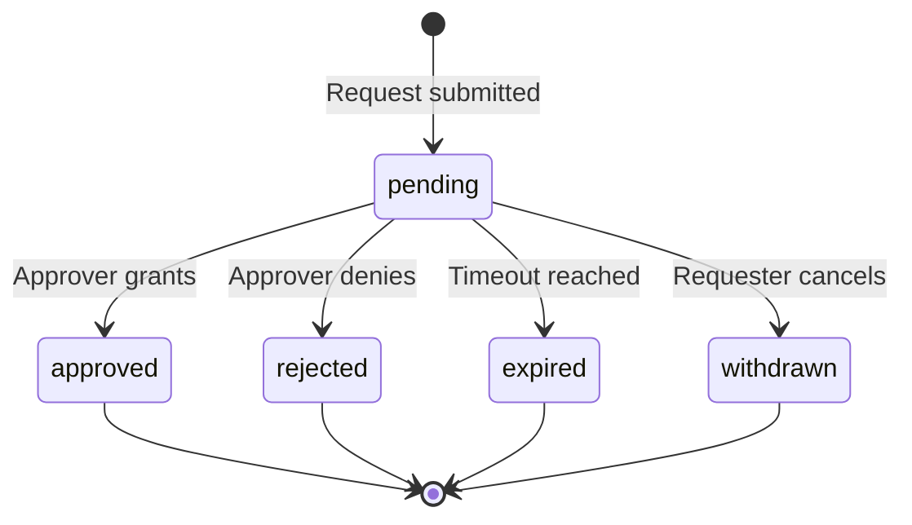

# Approval Rules

Authorization gates for the **AI Command Center** — when **Approval** is required, who approves, and how blocked work resumes.

> **Entity definitions:** [system-entities.md](system-entities.md) §6 Decision · §7 Approval  
> **Department routing:** [department-map.md](department-map.md)  
> **Tool triggers:** [tool-stack.md](tool-stack.md)  
> **Work Packet checklist:** [work-packet-template.md](work-packet-template.md)

---

## Purpose

Approvals protect the Command Center from unauthorized high-risk actions. Agents operate autonomously within **Tool Profile** boundaries. Actions that exceed those boundaries, affect external parties, or produce irreversible results require human **Approval** before proceeding.

Every Approval must link to a subject entity (`decision`, `task`, `work_packet`, or `output`) and produce **Execution Log** entries on request, decision, and resolution.

---

## Default Posture

| Principle | Rule |
|-----------|------|
| **Autonomous by default** | Read, draft, and internal state changes do not require Approval |
| **Approve before external impact** | Sending, publishing, spending, or deleting externally requires Approval |
| **Approve before irreversible action** | Commits to protected branches, production deploys, data deletion require Approval |
| **Department owns policy** | Each department may add stricter rules; none may weaken core gates below |
| **Log everything material** | Approval requests and outcomes are Execution Log events |

---

## Approval Triggers

### Category A — Always Required

These actions require Approval regardless of department. No agent may proceed autonomously.

| Trigger | Subject type | Approver role | Blocks until |
|---------|--------------|---------------|--------------|
| Send external email | `output` or `task` | Operations lead | `approved` |
| Emit webhook to production target | `task` | Engineering lead | `approved` |
| Execute destructive shell command | `task` | Engineering lead | `approved` |
| Commit to protected branch | `task` | Engineering lead | `approved` |
| Create scheduled automation | `task` | Operations lead | `approved` |
| Deliver Output to external requester | `output` | Operations lead | `approved` |
| Release domain-specific submission (GovCon) | `output` | Domain owner + Operations | `approved` |

### Category B — Required When Specified

These require Approval when the **Work Packet** or **Tool Profile** explicitly flags them.

| Trigger | Condition | Approver role |
|---------|-----------|---------------|
| Start Work Packet execution | Work Packet `approval required before start = yes` | Department lead |
| Confirm Decision | Decision status → `pending_approval` | Department lead |
| Invoke restricted tool | Tool not in assigned Tool Profile | Platform lead |
| Exceed cost/budget constraint | Work Packet constraint breached | Department lead |

See [work-packet-template.md](work-packet-template.md) § Constraints and [tool-stack.md](tool-stack.md) for configuration points.

### Category C — Never Required (Autonomous)

These actions proceed without Approval but must be logged.

| Action | Log requirement |
|--------|-----------------|
| Read repository, documents, Research Assets | `tool_call` entry |
| Draft email or Output (not delivered) | `tool_call` entry |
| Create or update Work Packet in `draft` | `state_change` entry |
| Record Decision with status `proposed` | `state_change` entry |
| Raise Blocker | `state_change` entry |
| Internal Task status updates | `state_change` entry |

---

## Approver Roles

Roles are human assignments — not entities. A role maps to one or more people per department.

| Role | Scope | Typical department |
|------|-------|--------------------|
| **Department lead** | Work Packets, Decisions, and Tasks within their department | All |
| **Platform lead** | Cross-department standards, Tool Profiles, entity changes | Platform |
| **Engineering lead** | Code, infrastructure, technical Outputs | Engineering |
| **Operations lead** | External comms, delivery, scheduling | Operations |
| **Domain owner** | Implementation domain submissions (for example, GovCon) | Domain teams |

Approver assignment is recorded in the Approval entity `approver` field per [system-entities.md](system-entities.md) §7.

---

## Approval Lifecycle



### Status Effects on Subject Entities

| Approval status | Effect on subject |
|-----------------|-------------------|
| `pending` | Subject frozen at gate (Task → `in_review`, Work Packet → `pending_approval`, Output → `in_review`) |
| `approved` | Subject may proceed to next lifecycle state |
| `rejected` | Subject returns for revision; Task may move to `blocked` or `backlog` |
| `expired` | Subject remains blocked; new Approval request required |
| `withdrawn` | Gate removed; subject returns to pre-request state |

---

## Decision ↔ Approval Interaction

**Decisions** that commit the Command Center to a high-risk path must transition to `pending_approval` before taking effect.

| Decision type | Approval required |
|---------------|-------------------|
| Tool or architecture selection (internal, reversible) | No — status `confirmed` |
| External vendor or spend commitment | Yes |
| Data retention or deletion policy | Yes |
| Domain submission to client or agency (GovCon) | Yes |
| Override of a Blocker marked `won_t_fix` | Yes |

Approved Decisions move to status `approved`. Rejected Decisions move to `rejected` and the related Task should record rationale in an Execution Log entry.

---

## Work Packet Approval Gates

Evaluate during Work Packet authoring ([work-packet-template.md](work-packet-template.md)):

| Work Packet characteristic | Gate |
|----------------------------|------|
| External Output delivery | Approval before Output release |
| Production environment changes | Approval before Task execution |
| GovCon domain extension present | Domain owner Approval before Output release |
| Budget ceiling > threshold | Department lead Approval before start |
| Uses tools outside default Tool Profile | Platform lead Approval before start |

Set Work Packet status to `pending_approval` when gates are active. Move to `ready` or `in_execution` only after all required Approvals reach `approved`.

---

## Output Approval Gates

**Outputs** follow a review path before delivery:

```text
draft → in_review → approved → delivered
```

| Output type | Reviewer | Approval required for delivery |
|-------------|----------|-------------------------------|
| Internal report | Department lead | No (review only) |
| External message or email | Operations lead | Yes |
| Code change (via PR) | Engineering lead | Via PR process |
| Domain client submission | Domain owner + Operations | Yes |
| Data export | Department lead | Yes |

---

## Timeout and Escalation

| Parameter | Default value |
|-----------|---------------|
| Approval timeout | 48 hours |
| Escalation after timeout | Notify department lead; Approval status → `expired` |
| Re-request | New Approval entity; do not mutate expired records |

Expired Approvals create a **Blocker** on the subject Task if work cannot proceed.

---

## Execution Log Requirements

Record these events for every Approval:

| Event | `event_type` | Required fields |
|-------|--------------|-----------------|
| Approval requested | `state_change` | subject, requester, approver role |
| Approval granted | `approval_action` | approver, timestamp |
| Approval denied | `approval_action` | approver, reason |
| Approval expired | `state_change` | timeout duration |
| Work resumed after approval | `state_change` | subject new status |

---

## GovCon Domain Rules

GovCon is an implementation domain. It inherits all core Approval rules above and adds:

| Rule | Detail |
|------|--------|
| Client-facing deliverables | Always Category A — domain owner + Operations approval |
| Compliance-sensitive Outputs | Department lead review minimum; external submission requires Category A |
| Entity model | GovCon does not define separate approval entities — uses core Approval |

GovCon-specific Work Packet fields may indicate compliance tier, which determines approver role but does not bypass core gates.

---

## Implementation State

The governance tables that back these rules are **fully deployed**:

- `approvals`, `decisions`, and `blockers` are live in the Supabase runtime (migrations `011`, `013`, `017`).
- Row Level Security is implemented and enforced for all three tables.
- The database records approval rows, enforces `category IN ('a', 'b')`, enforces the `decided_at` paired invariant, and restricts role-based INSERT/UPDATE access per the policies in `013` and `017`.

**What the application layer still owns:**
- Orchestrating the approval request → resolution lifecycle (creating approval rows, routing to the right approver, surfacing pending gates to the UI).
- Enforcing Layer 5 approval gates before privileged transitions (output delivery, work packet execution start, schedule creation, high-risk decision confirmation, `won_t_fix` override) — the database does not block these transitions at the SQL level.
- The expiry sweep (transitioning `pending → expired` after 48 h) is a service-role scheduled job; authenticated sessions cannot set `status = 'expired'`.

These rules map directly to [system-entities.md](system-entities.md) §7, the deployed schema in migrations `011`/`013`/`017`, and the Layer 5 gate contract in the G-phase API plans.
