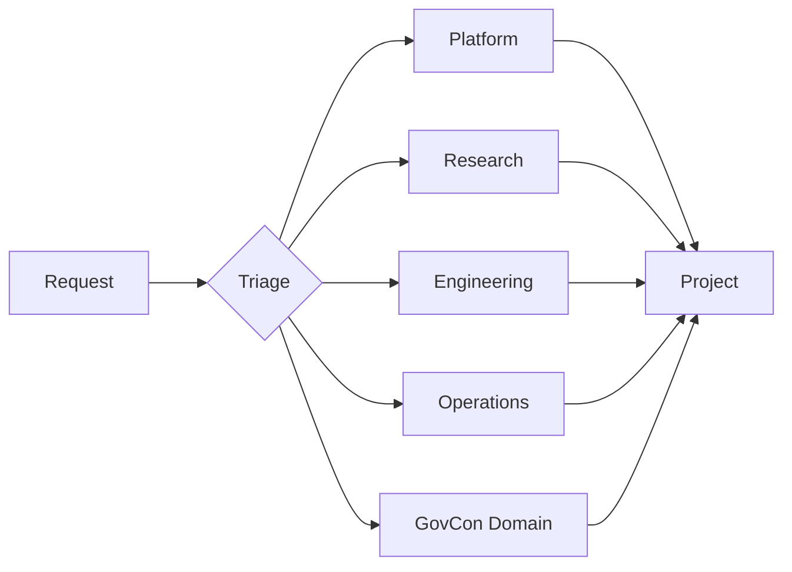

# Department Map

Organizational structure for routing **Requests**, owning **Projects**, and configuring **Tool Profiles** in the AI Command Center.

> **Entity definition:** [system-entities.md](system-entities.md) §3 Department  
> **Tool access:** [tool-stack.md](tool-stack.md)  
> **Approval policies:** [approval-rules.md](approval-rules.md)  
> **Work Packet routing:** [work-packet-template.md](work-packet-template.md)

---

## Purpose

**Departments** are the routing and accountability layer of the Command Center. Each department has a defined mission, default **Tool Profile**, and approval posture. Requests are triaged to departments before work is scoped into **Projects** and **Work Packets**.

Implementation domains (for example, GovCon) operate *within* departments or as domain extensions — they do not replace the department structure.

---

## Department Overview

---

## Core Departments

### Platform

| Field | Value |
|-------|-------|
| **Mission** | Maintain the Command Center core — entities, documentation, tool profiles, and cross-department standards |
| **Status** | `active` |
| **Default Tool Profile** | `platform-standard` ([tool-stack.md](tool-stack.md)) |
| **Owns** | Platform documentation, entity model evolution, APP 5+ runtime design |

**Routes here when:**

- Work affects core entities, operating docs, or shared platform behavior
- Cross-department standards or Tool Profile definitions need changes
- Supabase setup validation and runtime data model design (APP 5)

**Does not own:**

- Domain-specific product logic (GovCon capture, compliance, etc.)
- Day-to-day client or vertical deliverables

---

### Research

| Field | Value |
|-------|-------|
| **Mission** | Gather, synthesize, and maintain **Research Assets** that inform decisions and Work Packets |
| **Status** | `active` |
| **Default Tool Profile** | `research-readonly` ([tool-stack.md](tool-stack.md)) |
| **Owns** | Research Asset quality, source verification, knowledge synthesis Outputs |

**Routes here when:**

- Request requires investigation, literature review, or competitive analysis
- Work Packet is primarily information gathering with no code or external delivery
- Research Assets need creation, refresh, or archival

---

### Engineering

| Field | Value |
|-------|-------|
| **Mission** | Design and implement software, integrations, and technical **Outputs** for the Command Center and its domains |
| **Status** | `active` |
| **Default Tool Profile** | `engineering-standard` ([tool-stack.md](tool-stack.md)) |
| **Owns** | Application code, repository changes, technical Workflows, APP 5+ implementation |

**Routes here when:**

- Request involves code, architecture, APIs, or repository changes
- Work Packet acceptance criteria include deployable artifacts
- Tool or integration implementation is required

**Phase 0 note:** Engineering owns future runtime implementation but does not scaffold code until Phase 0 docs are reviewed.

---

### Operations

| Field | Value |
|-------|-------|
| **Mission** | Run day-to-day Command Center operations — triage, scheduling, external communications, and delivery coordination |
| **Status** | `active` |
| **Default Tool Profile** | `operations-external` ([tool-stack.md](tool-stack.md)) |
| **Owns** | Request triage, Output delivery, scheduled automations, external comms |

**Routes here when:**

- Request requires external communication (email, webhook, notification)
- Work involves scheduling, monitoring, or operational follow-through
- Output delivery to requesters or downstream systems

---

## Implementation Domain: GovCon

GovCon is **not a core department** — it is an implementation domain that extends the platform for government contracting workflows.

| Field | Value |
|-------|-------|
| **Type** | Implementation domain (extends core departments) |
| **Mission** | Apply Command Center entities to GovCon capture, proposal, and compliance workflows |
| **Primary department affiliation** | Research (analysis) · Engineering (automation) · Operations (delivery) |
| **Default Tool Profile** | Inherited from owning department |
| **Domain extensions** | GovCon-specific Work Packet fields, Research Asset types, Workflow templates |

**Routes here when:**

- Request explicitly concerns government contracting work
- Work Packet includes GovCon domain extension fields

**Constraints:**

- Must use core entities from [system-entities.md](system-entities.md)
- Must not introduce parallel entity types
- Approval rules for external submission and client delivery still apply per [approval-rules.md](approval-rules.md)

---

## Triage Decision Matrix

Use this matrix during Request triage. When multiple departments apply, assign a **primary owner** and list **collaborators** in the Work Packet.

| Request signal | Primary department | Common collaborators |
|----------------|-------------------|---------------------|
| Entity model, docs, platform standards | Platform | Engineering |
| Investigation, analysis, knowledge gathering | Research | Platform |
| Code, integrations, technical build | Engineering | Platform |
| External comms, scheduling, delivery | Operations | Engineering |
| GovCon-specific workflow | Owning dept by task type | GovCon domain context |

---

## Department → Entity Responsibilities

| Entity | Platform | Research | Engineering | Operations |
|--------|----------|----------|-------------|------------|
| Request | Triage standards | — | — | Primary triage |
| Project | Core platform projects | Research initiatives | Build projects | Ops runbooks |
| Work Packet | Template and standards | Research packets | Engineering packets | Delivery packets |
| Task | — | Analysis tasks | Implementation tasks | Comms/scheduling tasks |
| Tool Profile | Defines profiles | Uses `research-readonly` | Uses `engineering-standard` | Uses `operations-external` |
| Approval | Policy definition | Research release | Code merge/deployment | External send |
| Output | Documentation | Reports, briefs | Code, configs | Delivered messages |
| Blocker | Cross-dept escalation | Source access | Technical deps | External waits |

---

## Escalation Path

When a **Blocker** cannot be resolved within the owning department:

1. Raise Blocker with severity `high` or `critical`
2. Notify Platform for cross-department conflicts
3. Record **Decision** documenting escalation rationale
4. If external or irreversible action is proposed, trigger **Approval** per [approval-rules.md](approval-rules.md)

---

## Adding or Modifying Departments

New core departments require:

1. Definition in this document (mission, tool profile, routing rules)
2. Alignment with [system-entities.md](system-entities.md) §3 Department
3. Tool Profile entry in [tool-stack.md](tool-stack.md)
4. Approval policy updates in [approval-rules.md](approval-rules.md) if posture differs

Implementation domains do not require a new core department — they extend existing departments with domain-specific Work Packet sections and Workflow templates.
