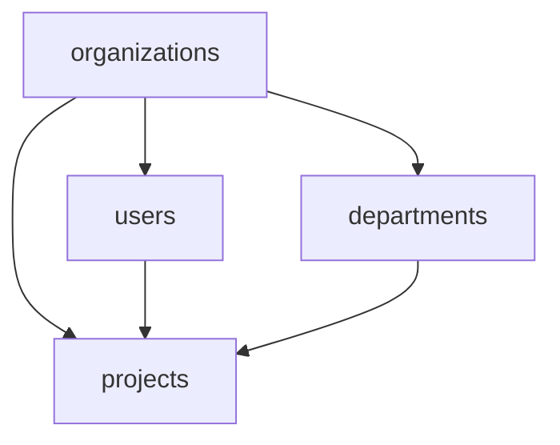

# Phase A — Foundation Migration Plan

Planning document for the first Supabase migration phase of the **AI Command Center**.

> **Canonical entities:** [system-entities.md](system-entities.md)  
> **Runtime data model:** [supabase-runtime-data-model.md](supabase-runtime-data-model.md)  
> **Operating flow:** [system-overview.md](system-overview.md)  
> **Approval gates:** [approval-rules.md](approval-rules.md)  
> **Department routing:** [department-map.md](department-map.md)

This document is **planning only**. It does not contain SQL, migration files, Supabase dashboard instructions, or application code.

---

## Scope

Phase A establishes the **foundational tables** every other table in the system depends on. No execution, governance, or knowledge data can be safely written without these tables in place.

| Table | Entity source | Layer |
|-------|--------------|-------|
| `organizations` | System extension | System |
| `users` | System extension + Supabase Auth | System |
| `departments` | §3 Department | Registry |
| `projects` | §2 Project | Registry |

> **Note on phasing:** [supabase-runtime-data-model.md](supabase-runtime-data-model.md) §7 originally separated `organizations`/`users` (Phase A) from `departments`/`projects` (Phase B). This plan merges them into a single deployable foundation phase because `departments` and `projects` have no dependencies outside of `organizations` and `users`, and seeding them together allows the full Request-triage flow to be validated in one pass.

---

## Migration Order

Create tables in this exact order. Each table depends on the one(s) above it.

```text
1. organizations         (no dependencies)
2. users                 (depends on: organizations + Supabase auth.users)
3. departments           (depends on: organizations)
4. projects              (depends on: organizations, departments)
```

`users` and `departments` have no dependency on each other, but `users` must exist before `projects` because `projects` will carry a `created_by` user reference. `departments` must exist before `projects` because `projects.owning_department_id` is a required FK.

---

## Dependency Graph



All Phase A tables are direct children of `organizations`. `projects` is the only table with multiple parents in this phase.

---

## Table Definitions

---

### 1. `organizations`

#### Purpose

The top-level multi-tenant boundary. Every row in the system is scoped to an `organization_id`. Prevents data leakage between tenants by design.

Maps to the System Layer in [supabase-runtime-data-model.md](supabase-runtime-data-model.md). Has no canonical entity in [system-entities.md](system-entities.md) — it is a system-level container for the platform.

#### Required Fields

| Field | Type | Notes |
|-------|------|-------|
| `id` | uuid | Primary key; generated |
| `name` | text | Human-readable org name; non-empty |
| `slug` | text | URL-safe unique identifier; unique across all orgs |
| `status` | text / enum | `active`, `suspended`, `archived` |
| `created_at` | timestamptz | Set on insert; UTC |
| `updated_at` | timestamptz | Updated on every write |

#### Foreign Keys

None. `organizations` is the root table.

#### Recommended Indexes

| Index | Reason |
|-------|--------|
| Unique on `slug` | Lookup by subdomain or URL path; enforces global uniqueness |
| Index on `status` | Filter to active orgs in admin queries |

#### RLS Considerations

- All tenant-scoped tables join to `organizations` via `organization_id`.
- Users may only read the organization row for their own org.
- Only org admins (or the service role) may update `organizations`.
- No cross-org reads under any user role.
- RLS on `organizations` itself: `id = current_org_id_from_jwt()` pattern.

#### Ownership Rules

- **Owned by:** Platform department
- **Who creates rows:** Service role only (org provisioning); no user-initiated self-registration without an invite or onboarding flow
- **Who may update rows:** Org admin role or service role

#### Initial Seed Requirements

The first migration should seed a single organization representing the AI Command Center itself, used for internal platform testing and bootstrap validation:

| Field | Value |
|-------|-------|
| `name` | `AI Command Center` |
| `slug` | `ai-command-center` |
| `status` | `active` |

---

### 2. `users`

#### Purpose

Stores human operators, agent service identities, and automation actors. Links to Supabase Auth (`auth.users`) via `auth_user_id`. Every actor referenced across the system (`submitted_by`, `assigned_to`, `approver`, `decided_by`, `created_by`) points to a row here.

Approver roles defined in [approval-rules.md](approval-rules.md) are stored on this table.

#### Required Fields

| Field | Type | Notes |
|-------|------|-------|
| `id` | uuid | Primary key; generated |
| `organization_id` | uuid | FK → `organizations.id`; required |
| `auth_user_id` | uuid | FK → `auth.users.id`; unique; nullable for service/agent identities without login |
| `email` | text | Unique within org; used for notifications |
| `display_name` | text | Human-readable label |
| `role` | text / enum | `org_admin`, `department_lead`, `department_member`, `agent`, `read_only` |
| `department_id` | uuid | FK → `departments.id`; nullable — set after departments exist; nullable at insert for org admin who bootstraps before departments are seeded |
| `status` | text / enum | `active`, `invited`, `suspended`, `archived` |
| `created_at` | timestamptz | UTC |
| `updated_at` | timestamptz | Updated on every write |

#### Foreign Keys

| FK column | References | Notes |
|-----------|------------|-------|
| `organization_id` | `organizations.id` | Required; on delete restrict |
| `auth_user_id` | `auth.users.id` | Unique; nullable for agent identities |
| `department_id` | `departments.id` | Nullable at creation; set FK deferrable or update after departments seed |

> **Bootstrap note:** The first user (org admin) is inserted before `departments` exists. `department_id` must be nullable or the FK must be deferred so the admin user can be created, then `departments` seeded, then the admin updated with a `department_id`.

#### Recommended Indexes

| Index | Reason |
|-------|--------|
| Unique on `(organization_id, email)` | Enforce unique email per org; support login lookup |
| Unique on `auth_user_id` | One `users` row per Supabase auth identity |
| Index on `(organization_id, role)` | Role-based filtering in RLS policies |
| Index on `(organization_id, department_id)` | Department-scoped user queries |
| Index on `status` | Filter active users |

#### RLS Considerations

- Users may read any other `users` row in the same org (peer visibility for assignment and approval UX).
- Only org admins and Platform leads may insert or update user roles.
- Agent identities (`role = 'agent'`) have no `auth_user_id` and cannot authenticate through Supabase Auth; they use a service-role key with a scoped JWT.
- Invited users (`status = 'invited'`) are visible to admins but not listed in assignment dropdowns until `active`.

#### Ownership Rules

- **Owned by:** Platform department (schema); org admin (membership management)
- **Who creates rows:** Org admin via invite flow, or service role for agent identities
- **Who may update rows:** Org admin (all fields); user self (display_name, email only)
- **Who may deactivate:** Org admin only

#### Initial Seed Requirements

Seed one user representing the platform administrator for bootstrap testing:

| Field | Value |
|-------|-------|
| `organization_id` | `ai-command-center` org id |
| `email` | Platform admin email |
| `display_name` | `Platform Admin` |
| `role` | `org_admin` |
| `status` | `active` |
| `auth_user_id` | Linked after Supabase Auth user is created |

`department_id` left null at seed; updated after departments are created.

---

### 3. `departments`

#### Purpose

Organizational units for routing Requests, owning Projects, and configuring Tool Profiles. Maps to [system-entities.md](system-entities.md) §3 Department. Departments are stable reference data — they change rarely and are referenced across the entire system.

The four core departments from [department-map.md](department-map.md) must be seeded before any operational data can be correctly routed: **Platform**, **Research**, **Engineering**, **Operations**.

#### Required Fields

| Field | Type | Notes |
|-------|------|-------|
| `id` | uuid | Primary key; generated |
| `organization_id` | uuid | FK → `organizations.id`; required |
| `name` | text | Department name; unique within org |
| `slug` | text | URL-safe identifier; unique within org |
| `mission` | text | Scope statement from [department-map.md](department-map.md) |
| `default_tool_profile_id` | uuid | FK → `tool_profiles.id`; nullable at Phase A — tool profiles are created in Phase B |
| `status` | text / enum | `active`, `inactive`, `archived` |
| `created_at` | timestamptz | UTC |
| `updated_at` | timestamptz | UTC |

#### Foreign Keys

| FK column | References | Notes |
|-----------|------------|-------|
| `organization_id` | `organizations.id` | Required; on delete restrict |
| `default_tool_profile_id` | `tool_profiles.id` | Nullable at Phase A; set after Phase B; deferred FK or nullable |

#### Recommended Indexes

| Index | Reason |
|-------|--------|
| Unique on `(organization_id, slug)` | Enforce unique slug per org; URL routing |
| Unique on `(organization_id, name)` | Prevent duplicate department names |
| Index on `(organization_id, status)` | Filter active departments for routing UI |

#### RLS Considerations

- All authenticated org members may read `departments` — department names and missions are not sensitive.
- Only Platform leads and org admins may insert or update department rows.
- Archived departments (`status = 'archived'`) should be excluded from routing queries by default; readable for historical reference.
- No department may be hard-deleted if Projects, Tasks, or Users reference it.

#### Ownership Rules

- **Owned by:** Platform department (definitions); org admin (status changes)
- **Who creates rows:** Platform lead or org admin; service role at bootstrap
- **Who may update rows:** Platform lead (name, mission, status); any lead (default_tool_profile_id for their department, once profiles exist)

#### Initial Seed Requirements

Seed the four core departments per [department-map.md](department-map.md):

| name | slug | mission summary | status |
|------|------|-----------------|--------|
| Platform | `platform` | Maintain core entities, docs, tool profiles, cross-department standards | `active` |
| Research | `research` | Gather, synthesize, and maintain Research Assets | `active` |
| Engineering | `engineering` | Design and implement software, integrations, and technical Outputs | `active` |
| Operations | `operations` | Run day-to-day operations — triage, scheduling, external comms, delivery | `active` |

All four rows share the bootstrap `organization_id`. `default_tool_profile_id` is null until Phase B creates `tool_profiles`.

---

### 4. `projects`

#### Purpose

Durable containers for related work. Every Task, Work Packet, Research Asset, Output, and Knowledge Record ties back to a Project. Maps to [system-entities.md](system-entities.md) §2 Project.

`projects` is the most widely-referenced table in the system after `organizations`. It is the natural grouping unit for all operational and knowledge data.

#### Required Fields

| Field | Type | Notes |
|-------|------|-------|
| `id` | uuid | Primary key; generated |
| `organization_id` | uuid | FK → `organizations.id`; required |
| `name` | text | Project title; non-empty |
| `objective` | text | Intended outcome statement |
| `owning_department_id` | uuid | FK → `departments.id`; required |
| `workflow_template_id` | uuid | FK → `workflows.id`; nullable — workflows created in Phase B |
| `created_by` | uuid | FK → `users.id`; required |
| `status` | text / enum | `draft`, `active`, `on_hold`, `completed`, `archived`, `cancelled` |
| `created_at` | timestamptz | UTC |
| `updated_at` | timestamptz | UTC |

#### Foreign Keys

| FK column | References | Notes |
|-----------|------------|-------|
| `organization_id` | `organizations.id` | Required; on delete restrict |
| `owning_department_id` | `departments.id` | Required; on delete restrict |
| `created_by` | `users.id` | Required; on delete restrict |
| `workflow_template_id` | `workflows.id` | Nullable at Phase A; set in Phase B; deferred or nullable |

#### Recommended Indexes

| Index | Reason |
|-------|--------|
| Index on `(organization_id, owning_department_id)` | Department-scoped project lists; RLS join |
| Index on `(organization_id, status)` | Filter by active/draft/archived for dashboards |
| Index on `created_by` | User's project history |
| Index on `(organization_id, created_at DESC)` | Recency-ordered project feeds |

#### RLS Considerations

- Users read projects where `owning_department_id` matches a department they belong to, or where they are the `created_by` user.
- A future `project_members` junction table (Phase F or beyond) will extend read access to collaborators outside the owning department.
- Department leads and org admins may update `status`, `name`, `objective`, and `owning_department_id`.
- Department members may create new projects in their department; they become the `created_by` and initial owner.
- Projects may not be hard-deleted if Tasks, Work Packets, Outputs, or Knowledge Records exist on them.

#### Ownership Rules

- **Owned by:** Assigned `owning_department_id`
- **Who creates rows:** Any authenticated department member or lead
- **Who may update rows:** Owning department lead (all fields); creator (name, objective)
- **Who may archive/cancel:** Department lead or org admin only

#### Initial Seed Requirements

No project seed is strictly required for Phase A. However, a single bootstrap project supports end-to-end Phase A validation:

| Field | Value |
|-------|-------|
| `name` | `AI Command Center Bootstrap` |
| `objective` | `Validate Phase A tables and seeded reference data` |
| `owning_department_id` | Platform department id |
| `created_by` | Platform admin user id |
| `status` | `active` |

---

## Future Dependencies

These tables from later phases have direct FKs into Phase A tables. Phase A must be stable before these are created.

| Future table | Depends on Phase A table | FK column |
|-------------|--------------------------|-----------|
| `tool_profiles` | `organizations`, `departments` | `organization_id`, `owner_department_id` |
| `workflows` | `organizations`, `departments`, `projects` | `organization_id`, `department_id`, `project_id` |
| `requests` | `organizations`, `departments`, `projects`, `users` | `organization_id`, `routed_department_id`, `project_id`, `submitted_by_user_id` |
| `tasks` | `organizations`, `departments`, `projects`, `users` | `organization_id`, `department_id`, `project_id`, `assigned_to_user_id` |
| `work_packets` | `organizations`, `projects`, `users` | `organization_id`, `parent_id` (when parent_type = project), `author_user_id` |
| `execution_logs` | `organizations`, `users` | `organization_id`, `actor` → `users.id` |
| `approvals` | `organizations`, `users` | `organization_id`, `requested_by`, `approver_user_id` |
| `decisions` | `organizations`, `users` | `organization_id`, `decided_by` |
| `blockers` | `organizations`, `users` | `organization_id`, `reported_by` |
| `research_assets` | `organizations`, `projects`, `users` | `organization_id`, `project_id`, `created_by` |
| `outputs` | `organizations`, `projects`, `users` | `organization_id`, `project_id` |
| `knowledge_records` | `organizations`, `projects`, `users` | `organization_id`, `project_id`, `created_by` |
| `audit_events` | `organizations`, `users` | `organization_id`, `actor_user_id` |

All 13 later-phase tables have at least one FK into `organizations`. All except `tool_profiles` have at least one FK into `users`.

---

## Phase A Validation Checklist

Complete before declaring Phase A done and beginning Phase B.

### Structure

- [ ] `organizations` table exists with all required fields
- [ ] `users` table exists with all required fields; `auth_user_id` unique constraint in place
- [ ] `departments` table exists with all required fields
- [ ] `projects` table exists with all required fields
- [ ] All non-nullable FKs enforce referential integrity
- [ ] Nullable FKs (`default_tool_profile_id`, `workflow_template_id`, `users.department_id`) accept null without error

### Seed Data

- [ ] Bootstrap organization row inserted
- [ ] Platform admin user created and linked to Supabase Auth
- [ ] Four core departments inserted (Platform, Research, Engineering, Operations)
- [ ] Admin user `department_id` updated to Platform department
- [ ] Bootstrap project inserted referencing Platform department and admin user

### RLS

- [ ] Authenticated user cannot read rows outside their `organization_id`
- [ ] Service role bypasses RLS correctly for seeding
- [ ] Platform admin can read and write all Phase A tables within their org
- [ ] Unauthenticated request returns no rows from any Phase A table

### Integration

- [ ] Supabase Auth user creation triggers `users` row insert (or manual step documented)
- [ ] All FK constraints verified via insert tests (attempt invalid FK → expect error)
- [ ] `updated_at` auto-updates on write

---

## Risks

### R1 — `users.department_id` Circular Dependency at Bootstrap

The first user (org admin) must be inserted before departments exist. If `department_id` is non-nullable or the FK is not deferred, the bootstrap insert will fail.

**Mitigation:** Declare `department_id` nullable in `users`. Update the admin row after departments are seeded. Document this as a required two-step bootstrap procedure.

### R2 — `departments.default_tool_profile_id` Forward Reference

`departments` needs `default_tool_profile_id` → `tool_profiles`, but `tool_profiles` does not exist in Phase A.

**Mitigation:** Declare `default_tool_profile_id` nullable in Phase A. Populate it during Phase B after `tool_profiles` is created.

### R3 — `projects.workflow_template_id` Forward Reference

Same pattern — `workflows` does not exist in Phase A.

**Mitigation:** Declare `workflow_template_id` nullable in Phase A. Populate in Phase B.

### R4 — Auth / Public Schema User Sync

Supabase Auth creates rows in `auth.users` (a managed schema). The public `users` table must be kept in sync. If a user signs up but no corresponding public row exists, all FK references (`created_by`, `assigned_to`, etc.) will fail.

**Mitigation:** Plan an Auth trigger or Edge Function (Phase B+) that inserts into `users` on `auth.users` INSERT. Document the manual fallback for Phase A bootstrap.

### R5 — RLS Bootstrapping Order

Enabling RLS before seed data is inserted will block the seed inserts unless they run as the service role.

**Mitigation:** All seed inserts must use the Supabase service role key. Enable RLS policies after seed data is confirmed. Document this explicitly in the migration runbook.

### R6 — Enum vs. Text for Status Columns

Using Postgres `ENUM` types for `status` columns makes future value additions require a migration. Using `text` with a check constraint is easier to extend but lacks DB-level type safety.

**Mitigation:** Decide the enum strategy before authoring Phase A SQL. Recommended default: use `text` with a `CHECK` constraint for Phase A; revisit after Phase B if type safety becomes a priority.

### R7 — Slug Uniqueness Scope

`organizations.slug` must be globally unique (cross-org). `departments.slug` only needs to be unique within an org. Incorrect unique constraint scope on either will either over-restrict or under-protect.

**Mitigation:** Apply a global unique index to `organizations.slug`. Apply a composite unique index on `(organization_id, slug)` for `departments`.

### R8 — Missing `project_members` Table

Projects currently determine read access by `owning_department_id`. Users outside the owning department cannot read project rows under the planned RLS policy. This blocks cross-department collaboration until a `project_members` table is added.

**Mitigation:** Accept the limitation for Phase A (single-department projects only). Flag `project_members` as a Phase F or early Phase B addition. Document the constraint in the RLS section above.

---

## Relationship to Full Migration Sequence

Phase A tables are steps 1–4 in the full migration order from [supabase-runtime-data-model.md](supabase-runtime-data-model.md) §7. The complete sequence continues:

| Phase | Tables |
|-------|--------|
| **A (this doc)** | `organizations`, `users`, `departments`, `projects` |
| B | `tool_profiles`, `workflows` |
| C | `requests`, `work_packets`, `tasks`, `execution_logs` |
| D | `decisions`, `approvals`, `blockers` |
| E | `research_assets`, junction tables, `outputs`, `knowledge_records` |
| F | RLS hardening, indexes, Realtime publication |

Phase A must be reviewed and signed off before Phase B begins.
