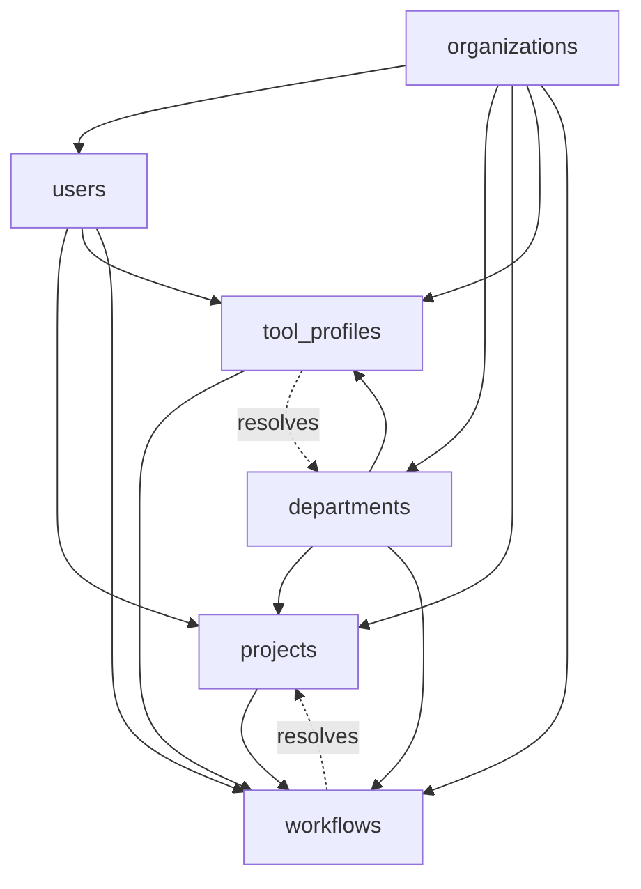

# Phase B — System Intelligence Migration Plan

Planning document for the second Supabase migration phase of the **AI Command Center**.

> **Canonical entities:** [system-entities.md](system-entities.md)  
> **Runtime data model:** [supabase-runtime-data-model.md](supabase-runtime-data-model.md)  
> **Phase A foundation:** [phase-a-foundation-migration-plan.md](phase-a-foundation-migration-plan.md)  
> **Operating flow:** [system-overview.md](system-overview.md)  
> **Tool categories and profiles:** [tool-stack.md](tool-stack.md)  
> **Department routing:** [department-map.md](department-map.md)

This document is **planning only**. It does not contain SQL, migration files, Supabase dashboard instructions, or application code.

**Prerequisite:** Phase A must be fully deployed and validated before Phase B begins. See [phase-a-foundation-migration-plan.md](phase-a-foundation-migration-plan.md) § Phase A Validation Checklist.

---

## Scope

Phase B introduces the **system intelligence layer** — the tables that govern how agents operate, what they are allowed to do, and how work is orchestrated across tasks.

| Table | Entity source | Layer |
|-------|--------------|-------|
| `tool_profiles` | §11 Tool Profile | Registry |
| `workflows` | §10 Workflow | Registry |

These two tables are prerequisites for every execution-layer table in Phase C (`requests`, `tasks`, `work_packets`, `execution_logs`). They also resolve the two forward-reference nullable FKs left open in Phase A.

---

## Relationship to Phase A

Phase A left two FK columns explicitly nullable pending Phase B:

| Phase A table | Nullable FK column | Resolved by |
|---------------|-------------------|-------------|
| `departments` | `default_tool_profile_id` | `tool_profiles` created in Phase B step 1 |
| `projects` | `workflow_template_id` | `workflows` created in Phase B step 2 |

Phase B also **depends on** all four Phase A tables:

| Phase A table | Used by Phase B as |
|---------------|--------------------|
| `organizations` | `organization_id` on both Phase B tables |
| `users` | `created_by` on both Phase B tables |
| `departments` | `owner_department_id` on `tool_profiles`; optional `department_id` on `workflows` |
| `projects` | Optional `project_id` on `workflows` (instance scope) |

Phase B does not modify any Phase A table schema. It only populates the nullable FK columns after its tables are created and seeded.

---

## Forward Reference Resolution

### `departments.default_tool_profile_id`

**From Phase A:** This column was declared nullable because `tool_profiles` did not yet exist.

**Resolution in Phase B:**

1. Create `tool_profiles` (Phase B step 1).
2. Seed the four canonical runtime profiles from [tool-stack.md](tool-stack.md): `command-center-brain`, `execution-worker`, `build-workshop`, `operations-external`.
3. Update the four seeded `departments` rows to set `default_tool_profile_id` to the appropriate profile.

| Department | Default tool profile |
|------------|---------------------|
| Command Center | `command-center-brain` |
| Research | `execution-worker` |
| App Builder / Website Builder | `build-workshop` |
| Operations | `operations-external` |

**Nullability:** Remains nullable long-term. New departments created before a matching profile exists should have `default_tool_profile_id = null` until a profile is assigned. The column must not be made non-nullable.

---

### `projects.workflow_template_id`

**From Phase A:** This column was declared nullable because `workflows` did not yet exist.

**Resolution in Phase B:**

1. Create `workflows` (Phase B step 2).
2. Seed platform-level workflow templates (see Initial Seed Requirements for `workflows`).
3. Optionally update the bootstrap project to reference the appropriate template.

**Nullability:** Remains nullable long-term. Most projects in early phases will have no workflow template assigned. The bootstrap project does not require one. The column must not be made non-nullable.

---

## Migration Order

Phase B tables must be created in this exact order. `workflows` depends on `tool_profiles` (every workflow is governed by a tool profile).

```text
Phase A tables (already deployed):
  1. organizations
  2. users
  3. departments
  4. projects

Phase B (this plan):
  5. tool_profiles     (depends on: organizations, departments, users)
  6. workflows         (depends on: organizations, departments, projects, tool_profiles, users)

Post-creation steps in Phase B:
  7. Update departments.default_tool_profile_id for seeded departments
  8. Update projects.workflow_template_id for bootstrap project (optional)
```

Steps 7 and 8 are data updates, not schema changes. They must run as the service role after RLS is enabled.

---

## Dependency Graph



Solid lines are FK dependencies (must exist before the child is created). Dashed lines show the Phase A forward-reference FKs that Phase B resolves by populating null columns.

---

## Table Definitions

---

### 1. `tool_profiles`

#### Purpose

Stores Tool Profile rows that govern what tools agents and automations are permitted to invoke during Task and Workflow execution. Maps to [system-entities.md](system-entities.md) §11 Tool Profile.

Each profile defines an `allowed_tools` list and a `constraints` object. These are the runtime source of truth for least-privilege agent boundaries, and they correspond directly to the profiles described in [tool-stack.md](tool-stack.md).

`tool_profiles` is a **configuration table** — it changes rarely and is read on every agent execution.

#### Required Fields

| Field | Type | Notes |
|-------|------|-------|
| `id` | uuid | Primary key; generated |
| `organization_id` | uuid | FK → `organizations.id`; required |
| `name` | text | Profile name; unique within org |
| `slug` | text | URL-safe identifier; unique within org |
| `description` | text | Human-readable summary of what this profile permits |
| `allowed_tools` | jsonb | Array of permitted tool ID strings from [tool-stack.md](tool-stack.md) |
| `constraints` | jsonb | Object defining rate limits, scope restrictions, environment boundaries, and approval triggers |
| `owner_department_id` | uuid | FK → `departments.id`; department responsible for maintaining this profile |
| `created_by` | uuid | FK → `users.id`; user who created the profile |
| `status` | text / enum | `draft`, `active`, `deprecated`, `archived` |
| `created_at` | timestamptz | UTC |
| `updated_at` | timestamptz | UTC |

#### Foreign Keys

| FK column | References | Notes |
|-----------|------------|-------|
| `organization_id` | `organizations.id` | Required; on delete restrict |
| `owner_department_id` | `departments.id` | Required; on delete restrict |
| `created_by` | `users.id` | Required; on delete restrict |

No forward-reference FKs. All dependencies exist in Phase A.

#### Recommended Indexes

| Index | Reason |
|-------|--------|
| Unique on `(organization_id, slug)` | Profile lookup by slug; routing uniqueness |
| Unique on `(organization_id, name)` | Prevent duplicate names within org |
| Index on `(organization_id, status)` | Filter active profiles; exclude archived |
| Index on `owner_department_id` | Department-scoped profile administration |

#### RLS Considerations

- All authenticated org members may **read** `tool_profiles` — agents and users need to resolve which tools are permitted.
- Only Platform leads and org admins may **insert or update** `tool_profiles`. This prevents departments from self-escalating permissions.
- A department lead may read profiles for their own department but cannot modify them without Platform approval.
- `status = 'deprecated'` profiles remain readable (existing tasks may reference them) but should not be assignable to new tasks. Application layer enforces; RLS does not block reads.
- `status = 'archived'` profiles should be excluded from active assignment queries; a filtered view or application-layer filter handles this.

#### Ownership Rules

- **Owned by:** Platform department (schema and policy definition)
- **Who creates rows:** Platform lead or org admin; service role at bootstrap
- **Who may update rows:** Platform lead (any field); Engineering lead (constraints on engineering profiles, with Platform approval)
- **Who may deprecate/archive:** Platform lead or org admin only

#### Initial Seed Requirements

Seed four profiles matching [tool-stack.md](tool-stack.md) § Default Tool Profiles. All four share the bootstrap `organization_id` and are owned by the Command Center department.

The earlier planning names `platform-standard`, `research-readonly`, and `engineering-standard` are superseded by the runtime profiles below. Research tasks route through `execution-worker` unless a future research-specific profile is added.

**Profile: `command-center-brain`**

| Field | Value |
|-------|-------|
| `name` | `Command Center Brain` |
| `slug` | `command-center-brain` |
| `description` | `Strategic reasoning and orchestration profile for Command Center planning, routing, synthesis, and governance` |
| `owner_department_id` | Command Center department id |
| `status` | `active` |
| `allowed_tools` | All `acc.*` core tools; all `research.*` tools; `data.store.*`; `auto.workflow.run`, `auto.workflow.pause`, `auto.agent.invoke`; `ai.chatgpt`, `ai.claude`, `workspace.notion`, `data.supabase` |
| `constraints` | External delivery requires approval; destructive actions not allowed; service role use requires approval |

**Profile: `execution-worker`**

| Field | Value |
|-------|-------|
| `name` | `Execution Worker` |
| `slug` | `execution-worker` |
| `description` | `General execution profile for task work, research capture, internal automation, and operational follow-through` |
| `owner_department_id` | Command Center department id |
| `status` | `active` |
| `allowed_tools` | Task-oriented `acc.*` tools; all `research.*`; `data.store.read`, `data.store.write`; `auto.workflow.run`, `auto.workflow.pause`, `auto.agent.invoke`; `ai.chatgpt`, `ai.claude`, `workspace.notion`, `data.supabase`, `auto.n8n` |
| `constraints` | External delivery requires approval; scheduled production operations require approval; destructive actions not allowed |

**Profile: `build-workshop`**

| Field | Value |
|-------|-------|
| `name` | `Build Workshop` |
| `slug` | `build-workshop` |
| `description` | `Engineering and build profile for app, website, repository, deployment, and implementation work` |
| `owner_department_id` | Command Center department id |
| `status` | `active` |
| `allowed_tools` | `code.repo.read`, `code.repo.write`, `code.repo.commit`, `code.repo.pr.create`, `code.shell.exec`; `data.store.*`; `auto.agent.invoke`; `ide.cursor`, `code.github`, `data.supabase`, `infra.vercel`; `ai.claude`, `ai.openai_api` |
| `constraints` | Protected branch commits, production deployments, secret management, and destructive shell commands require approval |

**Profile: `operations-external`**

| Field | Value |
|-------|-------|
| `name` | `Operations External` |
| `slug` | `operations-external` |
| `description` | `Operations profile for documentation, coordination, external communication preparation, and controlled delivery` |
| `owner_department_id` | Command Center department id |
| `status` | `active` |
| `allowed_tools` | Request/task/output `acc.*` tools; `research.note.create`; `comms.email.draft`, `comms.email.send`, `comms.slack.post`, `comms.webhook.emit`; `auto.workflow.run`, `auto.workflow.pause`, `auto.schedule.create`; `workspace.notion`, `auto.n8n`, `ai.chatgpt`, `ai.claude` |
| `constraints` | Email send, external webhooks, schedule creation, and page deletion require approval |

After inserting these four profiles, run the department update step (migration step 7) to populate `departments.default_tool_profile_id`.

---

### 2. `workflows`

#### Purpose

Stores workflow definitions and running instances. A **template** (`kind = 'template'`) is a reusable orchestration blueprint owned by a department. An **instance** (`kind = 'instance'`) is a live execution of a template, attached to a specific project and spawning tasks.

Maps to [system-entities.md](system-entities.md) §10 Workflow.

`workflows` is the bridge between high-level project intent and ground-level task execution. It is governed by a `tool_profile_id`, ensuring the orchestration engine operates within defined tool boundaries.

#### Required Fields

| Field | Type | Notes |
|-------|------|-------|
| `id` | uuid | Primary key; generated |
| `organization_id` | uuid | FK → `organizations.id`; required |
| `name` | text | Workflow name |
| `kind` | text / enum | `template` or `instance`; required |
| `definition` | jsonb | Ordered steps, triggers, conditions, and handoff rules; required for templates; may be inherited from template for instances |
| `tool_profile_id` | uuid | FK → `tool_profiles.id`; required — governs which tools steps may invoke |
| `department_id` | uuid | FK → `departments.id`; nullable — set for department-owned templates; required for instances |
| `project_id` | uuid | FK → `projects.id`; nullable for templates; required for instances |
| `template_id` | uuid | FK → `workflows.id` (self-reference); nullable — set on instances to point back to their source template |
| `created_by` | uuid | FK → `users.id`; required |
| `status` | text / enum | `draft`, `active`, `paused`, `completed`, `failed`, `archived` |
| `created_at` | timestamptz | UTC |
| `updated_at` | timestamptz | UTC |

#### Foreign Keys

| FK column | References | Notes |
|-----------|------------|-------|
| `organization_id` | `organizations.id` | Required; on delete restrict |
| `tool_profile_id` | `tool_profiles.id` | Required; on delete restrict |
| `department_id` | `departments.id` | Nullable (templates may be org-wide); on delete restrict if set |
| `project_id` | `projects.id` | Nullable (templates have no project); on delete restrict if set |
| `template_id` | `workflows.id` | Nullable self-reference; instances point to their source template |
| `created_by` | `users.id` | Required; on delete restrict |

#### Recommended Indexes

| Index | Reason |
|-------|--------|
| Index on `(organization_id, kind)` | Separate template library from running instances |
| Index on `(organization_id, status)` | Filter active/paused instances; archived templates |
| Index on `(organization_id, department_id)` | Department-scoped workflow queries |
| Index on `project_id` | Project-scoped instance lookup |
| Index on `template_id` | Find all instances of a given template |
| Index on `tool_profile_id` | Audit which workflows use a given profile |

#### RLS Considerations

- Templates (`kind = 'template'`) are readable by all org members — they are shared blueprints.
- Instances (`kind = 'instance'`) follow the same department-scoped access as tasks: readable by users whose `department_id` matches the instance's `department_id`.
- Only Engineering leads and Platform leads may insert or update templates.
- Department leads may create instances from templates within their department scope.
- Instances in `status = 'active'` or `'paused'` may be updated by the department lead of the owning department.
- Instances in terminal states (`completed`, `failed`, `archived`) are read-only.
- Agents (service identity role) may update `status` on instances they are executing, but only to valid forward transitions (`active` → `paused`, `active` → `completed`, `active` → `failed`).

#### Ownership Rules

- **Templates owned by:** Engineering department (authoring); Platform department (governance and cross-org standards)
- **Instances owned by:** Department assigned at instance creation
- **Who creates templates:** Engineering lead or Platform lead; service role at bootstrap
- **Who creates instances:** Any department lead or department member with execution permission
- **Who may update instances:** Department lead of owning department; executing agent (status transitions only)
- **Who may archive templates:** Engineering lead or Platform lead; deprecates old versions

#### Initial Seed Requirements

Seed two workflow templates at bootstrap. `request-to-output` uses `command-center-brain`; `research-and-synthesize` uses `execution-worker` because research tasks route through the general execution profile until a future research-specific profile is added.

**Template: `request-to-output`**

| Field | Value |
|-------|-------|
| `name` | `Request to Output` |
| `kind` | `template` |
| `tool_profile_id` | `command-center-brain` profile id |
| `department_id` | Command Center department id |
| `project_id` | null (template; not project-scoped) |
| `status` | `active` |
| `definition` | Steps: receive request → triage → create work packet → execute tasks → review output → deliver |

**Template: `research-and-synthesize`**

| Field | Value |
|-------|-------|
| `name` | `Research and Synthesize` |
| `kind` | `template` |
| `tool_profile_id` | `execution-worker` profile id |
| `department_id` | Research department id |
| `project_id` | null |
| `status` | `active` |
| `definition` | Steps: define research question → gather research assets → synthesize → create knowledge record → review |

After inserting templates, optionally update `projects.workflow_template_id` on the bootstrap project to reference `request-to-output`.

---

## Future Dependencies

These Phase C–E tables have direct FK dependencies on Phase B tables. They cannot be created until Phase B is deployed and validated.

### Tables that depend on `tool_profiles`

| Future table | FK column | Notes |
|-------------|-----------|-------|
| `tasks` | `tool_profile_id` | Every task is governed by a profile; required FK |
| `execution_logs` | via `metadata` or FK | Logs reference the active profile when a tool call is made |

`departments.default_tool_profile_id` is also resolved in Phase B (data update, not a new table).

### Tables that depend on `workflows`

| Future table | FK column | Notes |
|-------------|-----------|-------|
| `tasks` | `workflow_id` | Optional; tasks may belong to a running workflow instance |
| `execution_logs` | `context_type = 'workflow'` | Workflow instances generate execution log entries |

`projects.workflow_template_id` is also resolved in Phase B (data update, not a new table).

### Full forward-dependency summary for Phase B tables

| Phase B table | Directly referenced by |
|---------------|----------------------|
| `tool_profiles` | `tasks`, `workflows`, `departments.default_tool_profile_id` |
| `workflows` | `tasks`, `execution_logs`, `projects.workflow_template_id` |

---

## Phase B Validation Checklist

Complete before declaring Phase B done and beginning Phase C.

### Structure

- [ ] `tool_profiles` table exists with all required fields
- [ ] `workflows` table exists with all required fields
- [ ] `workflows.template_id` self-reference FK is in place
- [ ] All required FKs on both tables enforce referential integrity
- [ ] Nullable FKs (`workflows.department_id`, `workflows.project_id`, `workflows.template_id`) accept null without error

### Forward Reference Resolution

- [ ] All four `departments` rows have `default_tool_profile_id` populated
- [ ] Bootstrap `projects` row has `workflow_template_id` populated (or explicitly null — document the decision)
- [ ] Both nullable FK updates executed as service role

### Seed Data

- [ ] Four tool profiles inserted: `command-center-brain`, `execution-worker`, `build-workshop`, `operations-external`
- [ ] Two workflow templates inserted: `request-to-output`, `research-and-synthesize`
- [ ] All seed rows have correct `organization_id` matching bootstrap org
- [ ] All seed `tool_profiles` owned by Platform department
- [ ] `research-and-synthesize` template uses `execution-worker` profile

### RLS

- [ ] Department member cannot insert a `tool_profiles` row (Platform-only write)
- [ ] Workflow templates readable by all org members
- [ ] Workflow instances readable only by users in the owning department
- [ ] Agents cannot create templates; only instances within their task scope

### Integration

- [ ] Insert a `workflows` row with an invalid `tool_profile_id` → expect FK violation
- [ ] Insert a `workflows` instance referencing a `template_id` that belongs to a different org → expect FK violation or RLS denial
- [ ] `updated_at` auto-updates on write for both tables

---

## Risks

### R1 — `tool_profiles.allowed_tools` Schema Enforcement

`allowed_tools` is stored as `jsonb`. Postgres will not enforce that values are valid tool IDs from [tool-stack.md](tool-stack.md). Invalid or misspelled tool IDs stored here will silently fail to match at execution time.

**Mitigation:** Establish a canonical list of tool IDs as a reference constant in application code or a lightweight validation table. Validate `allowed_tools` contents at insert time via application-layer checks or a Postgres function. Do not defer this to Phase F.

### R2 — `workflows.definition` Is Unstructured at Migration Time

The `definition` jsonb field holds steps, triggers, and handoff rules, but no schema enforces the shape. Two templates stored with incompatible `definition` structures will cause runtime failures when the workflow engine reads them.

**Mitigation:** Define the `definition` shape before seeding templates. Document the agreed schema as a versioned jsonb contract in a separate doc or inline as a comment in the seed data. Enforce shape validation at the application layer before insert.

### R3 — Self-Referencing FK on `workflows.template_id`

`template_id` points back to `workflows.id`. Circular references are not possible with a single-level self-join, but Postgres requires careful handling of the FK direction and deletion behavior.

**Mitigation:** Declare `template_id` as nullable with `ON DELETE SET NULL`. Deleting a template should not cascade-delete its instances; instead, set `instance.template_id = null` and log the orphaning event.

### R4 — `tool_profiles` Seeded Before Approval Rules Are Enforced at DB Level

The four bootstrap tool profiles are inserted by the service role before RLS or application-level approval checks exist. An incorrect seed (wrong `allowed_tools`) will propagate to all tasks in Phase C without guardrails.

**Mitigation:** Validate seeded profiles against [tool-stack.md](tool-stack.md) before Phase C begins. Include a Phase B validation step that reads back seeded `allowed_tools` and cross-checks against the canonical tool ID list.

### R5 — `workflows` Instance / Template Distinction Enforced Only at Application Layer

Postgres has no native support for enforcing that `project_id` is required on instances but not templates, or that `department_id` rules differ by `kind`. If application logic is bypassed or misconfigured, malformed rows can be inserted.

**Mitigation:** Add a Postgres check constraint that validates: if `kind = 'instance'` then `project_id IS NOT NULL`. For Phase B, add this as a documented constraint to be included in the SQL migration when authored.

### R6 — `departments.default_tool_profile_id` Update Must Run After RLS Is Enabled

If RLS is enabled before step 7 (updating department FK columns), the update may be blocked because department members cannot update `departments` rows.

**Mitigation:** Run step 7 as the service role, same as all seed inserts. Document this explicitly in the migration runbook. Sequence: create tables → disable RLS or use service role → seed data → run FK updates → enable RLS policies.

### R7 — No Mechanism Yet to Version Tool Profiles

If `allowed_tools` changes on an `active` profile, all tasks currently using that profile are silently affected. There is no snapshot or version history for profile state at time of task creation.

**Mitigation:** Accept this limitation for Phase B. Flag `tool_profile_versions` or a `task.tool_profile_snapshot` jsonb column as a Phase F consideration for audit-critical deployments.

---

## Relationship to Full Migration Sequence

| Phase | Tables |
|-------|--------|
| A | `organizations`, `users`, `departments`, `projects` |
| **B (this doc)** | `tool_profiles`, `workflows` |
| C | `requests`, `work_packets`, `tasks`, `execution_logs` |
| D | `decisions`, `approvals`, `blockers` |
| E | `research_assets`, junction tables, `outputs`, `knowledge_records` |
| F | RLS hardening, indexes, Realtime publication |

Phase B must be reviewed and validated before Phase C begins. Phase C's `tasks` table carries both `tool_profile_id` (required) and `workflow_id` (optional) — both come from Phase B tables.
