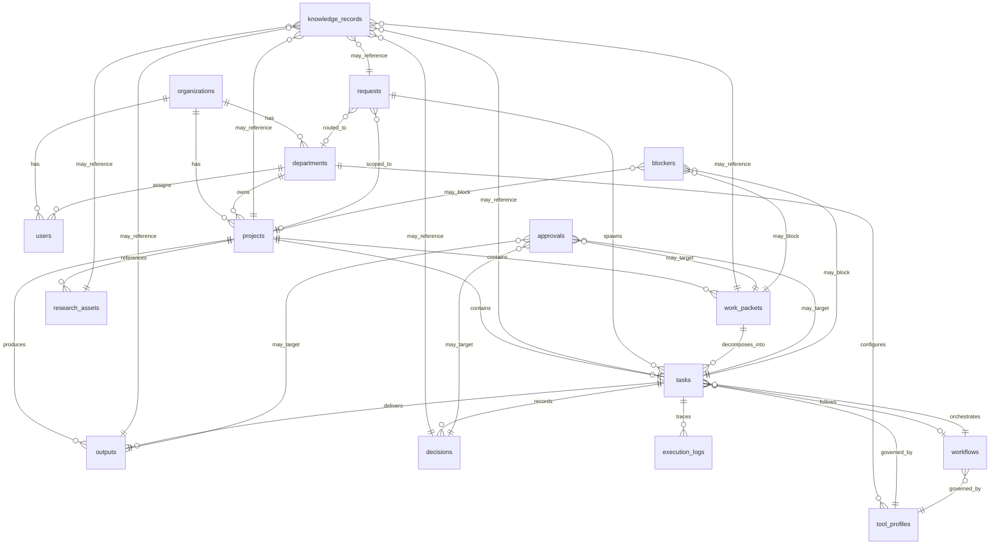

# Supabase Runtime Data Model

Runtime data architecture for the **AI Command Center** — mapping canonical entities to a future Supabase/Postgres persistence layer.

> **Canonical source of truth:** [system-entities.md](system-entities.md)  
> **Operating flow:** [system-overview.md](system-overview.md)  
> **Department routing:** [department-map.md](department-map.md)  
> **Approval gates:** [approval-rules.md](approval-rules.md)  
> **Work Packet fields:** [work-packet-template.md](work-packet-template.md)  
> **Tool boundaries:** [tool-stack.md](tool-stack.md)

This document is **architecture and design only**. It does not include SQL migrations, `CREATE TABLE` statements, Supabase schema files, Edge Functions, or application code.

Implementation domains (for example, GovCon) extend this model via domain tables — they do not replace core tables.

---

## 1. Purpose

Supabase provides the **runtime persistence and security layer** for the AI Command Center. Its role in the platform:

| Capability | Role in Command Center |
|------------|------------------------|
| **Postgres** | Stores canonical entities as relational tables with enforced referential integrity |
| **Row Level Security (RLS)** | Enforces department-scoped access, approval boundaries, and org isolation |
| **Auth** | Maps human operators to `users`; links agents and automations to service identities |
| **Realtime** | Pushes status changes for Tasks, Approvals, and Blockers to active sessions |
| **Storage** | Holds binary Research Asset payloads (documents, exports) referenced by `research_assets` |
| **Edge Functions** | Future: webhook intake, approval notifications, scheduled workflow triggers |

Supabase is **infrastructure**, not the product. The Command Center's behavioral model — entities, lifecycles, approvals, work packets — is defined in [system-entities.md](system-entities.md) and operational docs. Postgres tables are a **projection** of that model, not a redesign of it.

### Design Principles

1. **Entity-first** — Every core table maps to one canonical entity or a documented system extension (`audit_events`).
2. **Department-scoped ownership** — Rows carry `organization_id` and `department_id` for routing and RLS per [department-map.md](department-map.md).
3. **Append-only audit** — `execution_logs` and `audit_events` are never hard-deleted; corrections add new rows.
4. **Polymorphic governance** — `approvals` and `blockers` reference subjects by type + id, matching entity design.
5. **Domain extension via sidecar tables** — GovCon and other domains attach metadata tables keyed to core rows; core tables stay unchanged.

### Entity → Table Mapping

| Canonical entity ([system-entities.md](system-entities.md)) | Runtime table | Layer |
|-------------------------------------------------------------|---------------|-------|
| Department | `departments` | Registry |
| Project | `projects` | Registry |
| Tool Profile | `tool_profiles` | Registry |
| Workflow | `workflows` | Registry |
| Request | `requests` | Execution |
| Task | `tasks` | Execution |
| Work Packet | `work_packets` | Execution |
| Execution Log | `execution_logs` | Execution |
| Approval | `approvals` | Governance |
| Decision | `decisions` | Governance |
| Blocker | `blockers` | Governance |
| Research Asset | `research_assets` | Knowledge |
| Output | `outputs` | Knowledge |
| Knowledge Record | `knowledge_records` | Knowledge |
| *(system)* User | `users` | System |
| *(system)* Organization | `organizations` | System |
| *(system)* Audit envelope | `audit_events` | System |

---

## 2. Table Groups

Tables are grouped by operational concern. Groups reflect the entity layers in [system-overview.md](system-overview.md) with System Layer added for multi-tenancy and platform audit.

```text
┌─────────────────────────────────────────────────────────────┐
│  System Layer          organizations, users, audit_events   │
├─────────────────────────────────────────────────────────────┤
│  Registry Layer        departments, projects,               │
│                        tool_profiles, workflows             │
├─────────────────────────────────────────────────────────────┤
│  Execution Layer       requests, tasks, work_packets,       │
│                        execution_logs                         │
├─────────────────────────────────────────────────────────────┤
│  Governance Layer      approvals, decisions, blockers         │
├─────────────────────────────────────────────────────────────┤
│  Knowledge Layer       research_assets, outputs,            │
│                        knowledge_records                      │
└─────────────────────────────────────────────────────────────┘
```

### Registry Layer

Stable reference data and configuration. Changes infrequently; referenced by execution rows. Owned primarily by **Platform** department per [department-map.md](department-map.md).

### Execution Layer

High-churn operational data — intake, work specification, and audit trail of actions. Owned by the department assigned at triage.

### Governance Layer

Authorization and reasoning gates. Rows block or release execution-layer progress per [approval-rules.md](approval-rules.md).

### Knowledge Layer

Durable artifacts, raw inputs, and synthesized knowledge. `research_assets` and `outputs` map to canonical entities; `knowledge_records` is the universal memory layer that attaches curated context to any core entity. Research department owns asset quality; Platform owns the knowledge layer schema; content ownership follows the referenced entity's department.

### System Layer

Multi-tenant identity, membership, and platform-level audit envelope. Owned by **Platform**.

---

## 3. Proposed Tables

Field types are described conceptually (`uuid`, `text`, `timestamptz`, `jsonb`, `enum`). Exact Postgres types and constraints are deferred to migration authoring.

All tenant-scoped tables include `organization_id` unless noted. Timestamps `created_at` and `updated_at` are assumed on mutable tables.

---

### Registry Layer

#### `organizations`

| | |
|---|---|
| **Purpose** | Top-level tenant boundary. All Command Center data is scoped to an organization. |
| **Primary fields** | `id`, `name`, `slug`, `status`, `created_at` |
| **Relationships** | Parent to all tenant-scoped tables; has many `users`, `departments`, `projects` |
| **Ownership department** | Platform |

#### `departments`

| | |
|---|---|
| **Purpose** | Organizational unit for routing and accountability. Maps to [system-entities.md](system-entities.md) §3 Department. |
| **Primary fields** | `id`, `organization_id`, `name`, `slug`, `mission`, `default_tool_profile_id`, `status`, `created_at` |
| **Relationships** | Belongs to `organizations`; has many `projects`, `tool_profiles`, `tasks`; receives `requests` via `routed_department_id` |
| **Ownership department** | Platform |

Seed values align with [department-map.md](department-map.md): Platform, Research, Engineering, Operations.

#### `projects`

| | |
|---|---|
| **Purpose** | Durable work container. Maps to [system-entities.md](system-entities.md) §2 Project. |
| **Primary fields** | `id`, `organization_id`, `name`, `objective`, `owning_department_id`, `workflow_template_id`, `status`, `created_at`, `updated_at` |
| **Relationships** | Belongs to `departments`; has many `tasks`, `work_packets`, `outputs`, `research_assets`; referenced by `requests.project_id`; may be subject of `knowledge_records` |
| **Ownership department** | Assigned department (varies) |

#### `tool_profiles`

| | |
|---|---|
| **Purpose** | Tool and integration boundaries for agents. Maps to [system-entities.md](system-entities.md) §11 Tool Profile. |
| **Primary fields** | `id`, `organization_id`, `name`, `allowed_tools` (jsonb array), `constraints` (jsonb), `owner_department_id`, `status`, `created_at` |
| **Relationships** | Belongs to `departments`; referenced by `tasks.tool_profile_id`, `workflows.tool_profile_id`, `departments.default_tool_profile_id` |
| **Ownership department** | Platform (definitions); departments consume |

Tool IDs reference [tool-stack.md](tool-stack.md).

#### `workflows`

| | |
|---|---|
| **Purpose** | Orchestration templates and running instances. Maps to [system-entities.md](system-entities.md) §10 Workflow. |
| **Primary fields** | `id`, `organization_id`, `name`, `kind` (`template` \| `instance`), `definition` (jsonb), `project_id`, `department_id`, `tool_profile_id`, `status`, `created_at` |
| **Relationships** | Optional belongs to `projects`, `departments`; has many `tasks` via `tasks.workflow_id`; generates `execution_logs` |
| **Ownership department** | Engineering (templates); assigned department (instances) |

---

### Execution Layer

#### `requests`

| | |
|---|---|
| **Purpose** | Inbound intent — entry point for all work. Maps to [system-entities.md](system-entities.md) §1 Request. |
| **Primary fields** | `id`, `organization_id`, `source` (`human`, `automation`, `webhook`, `scheduled_job`), `intent`, `submitted_at`, `status`, `routed_department_id`, `project_id`, `submitted_by_user_id`, `metadata` (jsonb) |
| **Relationships** | Spawns `tasks`; generates `execution_logs` (context_type = `request`); optional link to `projects`, `departments`; may be subject of `knowledge_records` |
| **Ownership department** | Operations (triage); routed department thereafter |

#### `tasks`

| | |
|---|---|
| **Purpose** | Atomic unit of executable work. Maps to [system-entities.md](system-entities.md) §4 Task. |
| **Primary fields** | `id`, `organization_id`, `title`, `project_id`, `department_id`, `request_id`, `work_packet_id`, `workflow_id`, `tool_profile_id`, `priority`, `assigned_to_user_id`, `status`, `created_at`, `updated_at` |
| **Relationships** | Belongs to `projects`, `departments`; optional belongs to `requests`, `work_packets`, `workflows`, `tool_profiles`; has many `decisions`, `outputs`, `execution_logs`, `blockers`; many-to-many with `research_assets` via junction; may be subject of `knowledge_records` |
| **Ownership department** | Assigned `department_id` |

#### `work_packets`

| | |
|---|---|
| **Purpose** | Structured work specification and handoff artifact. Maps to [system-entities.md](system-entities.md) §5 Work Packet. Fields align with [work-packet-template.md](work-packet-template.md). |
| **Primary fields** | `id`, `organization_id`, `title`, `objective`, `scope` (jsonb: in/out lists), `acceptance_criteria` (jsonb), `parent_type` (`task` \| `project`), `parent_id`, `priority`, `constraints` (jsonb), `approval_required_before_start`, `author_user_id`, `status`, `created_at`, `updated_at` |
| **Relationships** | Attached to `tasks` or `projects` via `parent_type` + `parent_id`; may require `approvals`; many-to-many with `research_assets` via junction; may spawn `tasks`; may be subject of `knowledge_records` |
| **Ownership department** | Department of parent project or task |

#### `execution_logs`

| | |
|---|---|
| **Purpose** | Append-only action audit trail for requests, tasks, and workflows. Maps to [system-entities.md](system-entities.md) §12 Execution Log. |
| **Primary fields** | `id`, `organization_id`, `event_type` (`tool_call`, `state_change`, `error`, `note`, `approval_action`), `actor` (text: user id, agent id, or `system`), `occurred_at`, `summary`, `context_type` (`request`, `task`, `workflow`), `context_id`, `metadata` (jsonb), `status` (`recorded`, `flagged`, `reviewed`, `corrected`) |
| **Relationships** | Belongs to contextual entity; may reference `decisions`, `approvals`, `tool_profiles`, `blockers` via `metadata` or optional FK columns |
| **Ownership department** | Department of context entity |

> **Note:** `execution_logs` captures operational detail. `audit_events` (System Layer) captures platform-level security and admin actions. Both are append-only.

---

### Governance Layer

#### `approvals`

| | |
|---|---|
| **Purpose** | Authorization gates for high-risk actions. Maps to [system-entities.md](system-entities.md) §7 Approval. Rules in [approval-rules.md](approval-rules.md). |
| **Primary fields** | `id`, `organization_id`, `subject_type` (`decision`, `task`, `work_packet`, `output`), `subject_id`, `requested_by`, `requested_at`, `approver_user_id`, `approver_role`, `status`, `resolved_at`, `resolution_note` |
| **Relationships** | Polymorphic belongs to subject table; linked from `execution_logs`; may block subject entity progression |
| **Ownership department** | Department of subject entity |

#### `decisions`

| | |
|---|---|
| **Purpose** | Recorded choices with rationale during execution. Maps to [system-entities.md](system-entities.md) §6 Decision. |
| **Primary fields** | `id`, `organization_id`, `task_id`, `summary`, `rationale`, `decided_by`, `decided_at`, `status`, `metadata` (jsonb) |
| **Relationships** | Belongs to `tasks`; may require `approvals`; referenced in `execution_logs`; may be subject of `knowledge_records` |
| **Ownership department** | Task's `department_id` |

#### `blockers`

| | |
|---|---|
| **Purpose** | Impediments blocking task, work packet, or project progress. Maps to [system-entities.md](system-entities.md) §13 Blocker. |
| **Primary fields** | `id`, `organization_id`, `description`, `blocked_entity_type` (`task`, `work_packet`, `project`), `blocked_entity_id`, `severity`, `reported_by`, `reported_at`, `resolved_at`, `status` |
| **Relationships** | Polymorphic belongs to blocked entity; may reference `research_assets` via junction; generates `execution_logs` on create/resolve |
| **Ownership department** | Department of blocked entity |

---

### Knowledge Layer

#### `research_assets`

| | |
|---|---|
| **Purpose** | Knowledge inputs — documents, URLs, notes, datasets. Maps to [system-entities.md](system-entities.md) §8 Research Asset. |
| **Primary fields** | `id`, `organization_id`, `title`, `asset_type` (`document`, `url`, `note`, `dataset`, `transcript`, `other`), `source`, `storage_path`, `content_preview`, `captured_at`, `status`, `project_id`, `created_by` |
| **Relationships** | Optional belongs to `projects`; many-to-many with `tasks`, `work_packets` via junction tables; may inform `decisions`, `outputs`; may be subject of `knowledge_records` |
| **Ownership department** | Research (quality); creating department (custody) |

#### `outputs`

| | |
|---|---|
| **Purpose** | Deliverables produced by tasks. Maps to [system-entities.md](system-entities.md) §9 Output. |
| **Primary fields** | `id`, `organization_id`, `title`, `output_type` (`report`, `artifact`, `message`, `data`, `other`), `task_id`, `project_id`, `content`, `storage_path`, `produced_at`, `status`, `delivered_at` |
| **Relationships** | Belongs to `tasks`, `projects`; may require `approvals`; may reference `research_assets` via junction; may be subject of `knowledge_records` |
| **Ownership department** | Task's department; Operations for external delivery |

#### `knowledge_records`

| | |
|---|---|
| **Purpose** | Universal memory and knowledge layer — curated synthesis, summaries, constraints, lessons, and agent-readable context attachable to any core entity. Maps to [system-entities.md](system-entities.md) §14 Knowledge Record. Runtime table name: `knowledge_records`. |
| **Primary fields** | `id`, `organization_id`, `project_id` (optional), `subject_type` (`project`, `request`, `task`, `work_packet`, `decision`, `research_asset`, `output`), `subject_id`, `record_type`, `title`, `summary`, `content`, `source`, `confidence`, `created_by`, `created_at`, `updated_at`, `status` |
| **Relationships** | Polymorphic belongs to `projects`, `requests`, `tasks`, `work_packets`, `decisions`, `research_assets`, or `outputs` via `subject_type` + `subject_id`; optional `project_id` for scope anchoring; may be produced from `execution_logs` |
| **Ownership department** | Platform (schema); department of referenced subject entity (content) |

> **Distinction:** `research_assets` store raw inputs. `outputs` store deliverables. `knowledge_records` store curated, retrievable context agents use across sessions — scoped to whichever entity is most relevant. `execution_logs` remain the authoritative action audit.

---

### System Layer

#### `users`

| | |
|---|---|
| **Purpose** | Human operators and mapped service identities. Links to Supabase Auth `auth.users` via `auth_user_id`. |
| **Primary fields** | `id`, `organization_id`, `auth_user_id`, `email`, `display_name`, `role`, `department_id`, `status`, `created_at` |
| **Relationships** | Belongs to `organizations`, optional `departments`; referenced as `submitted_by`, `assigned_to`, `approver`, `author`, `decided_by` across tables |
| **Ownership department** | Platform |

Roles align with approver roles in [approval-rules.md](approval-rules.md): department lead, platform lead, engineering lead, operations lead, domain owner.

#### `audit_events`

| | |
|---|---|
| **Purpose** | Platform-level security and admin audit envelope — auth events, RLS denials, org settings changes, schema migrations applied. Complements operational `execution_logs`. |
| **Primary fields** | `id`, `organization_id`, `event_category` (`auth`, `security`, `admin`, `system`), `event_type`, `actor_user_id`, `occurred_at`, `summary`, `metadata` (jsonb), `ip_address`, `status` |
| **Relationships** | Belongs to `organizations`; optional `actor_user_id` → `users`; no FK to execution entities (intentionally separate) |
| **Ownership department** | Platform |

---

### Junction Tables (Supporting)

These are not canonical entities but are required to model many-to-many relationships from [system-entities.md](system-entities.md):

| Table | Purpose |
|-------|---------|
| `task_research_assets` | Links `tasks` ↔ `research_assets` |
| `work_packet_research_assets` | Links `work_packets` ↔ `research_assets` |
| `output_research_assets` | Links `outputs` ↔ `research_assets` |
| `blocker_research_assets` | Links `blockers` ↔ `research_assets` |

Each junction row: `organization_id`, both FK ids, `linked_at`, optional `notes`.

---

## 4. Relationship Map

### Core Flow Relationships



### Relationship Reference

| From table | To table | Cardinality | FK / pattern |
|------------|----------|-------------|--------------|
| `departments` | `organizations` | N:1 | `organization_id` |
| `projects` | `departments` | N:1 | `owning_department_id` |
| `projects` | `workflows` | N:0..1 | `workflow_template_id` |
| `tool_profiles` | `departments` | N:1 | `owner_department_id` |
| `requests` | `departments` | N:0..1 | `routed_department_id` |
| `requests` | `projects` | N:0..1 | `project_id` |
| `requests` | `tasks` | 1:N | `tasks.request_id` |
| `tasks` | `projects` | N:1 | `project_id` |
| `tasks` | `departments` | N:1 | `department_id` |
| `tasks` | `work_packets` | N:0..1 | `work_packet_id` |
| `tasks` | `workflows` | N:0..1 | `workflow_id` |
| `tasks` | `tool_profiles` | N:1 | `tool_profile_id` |
| `work_packets` | tasks OR projects | N:1 | `parent_type` + `parent_id` (polymorphic) |
| `execution_logs` | request, task, or workflow | N:1 | `context_type` + `context_id` (polymorphic) |
| `approvals` | decision, task, work_packet, output | N:1 | `subject_type` + `subject_id` (polymorphic) |
| `blockers` | task, work_packet, project | N:1 | `blocked_entity_type` + `blocked_entity_id` (polymorphic) |
| `decisions` | `tasks` | N:1 | `task_id` |
| `outputs` | `tasks`, `projects` | N:1 each | `task_id`, `project_id` |
| `research_assets` | `projects` | N:0..1 | `project_id` |
| `knowledge_records` | project, request, task, work_packet, decision, research_asset, output | N:1 | `subject_type` + `subject_id` (polymorphic) |
| `knowledge_records` | `projects` | N:0..1 | `project_id` (optional scope anchor) |
| `users` | `organizations`, `departments` | N:1 | `organization_id`, `department_id` |
| `audit_events` | `organizations` | N:1 | `organization_id` |

### Polymorphic Pattern Notes

`work_packets`, `execution_logs`, `approvals`, `blockers`, and `knowledge_records` use `*_type` + `*_id` pairs matching the conceptual model in [system-entities.md](system-entities.md). Application logic (or Postgres check constraints in a future migration) must validate that referenced rows exist and belong to the same `organization_id`.

---

## 5. Status Enums

Status values mirror [system-entities.md](system-entities.md) lifecycle definitions. Postgres enums or text columns with check constraints — implementation choice deferred.

### `requests.status`

| Value | Entity reference |
|-------|------------------|
| `received` | §1 Request |
| `triaged` | §1 Request |
| `in_progress` | §1 Request |
| `completed` | §1 Request |
| `rejected` | §1 Request |
| `cancelled` | §1 Request |

### `tasks.status`

| Value | Entity reference |
|-------|------------------|
| `backlog` | §4 Task |
| `ready` | §4 Task |
| `in_progress` | §4 Task |
| `blocked` | §4 Task — links to open `blockers` row |
| `in_review` | §4 Task |
| `done` | §4 Task |
| `cancelled` | §4 Task |

### `work_packets.status`

| Value | Entity reference |
|-------|------------------|
| `draft` | §5 Work Packet |
| `ready` | §5 Work Packet |
| `pending_approval` | §5 Work Packet |
| `in_execution` | §5 Work Packet |
| `accepted` | §5 Work Packet |
| `superseded` | §5 Work Packet |
| `cancelled` | §5 Work Packet |

### `approvals.status`

| Value | Entity reference |
|-------|------------------|
| `pending` | §7 Approval |
| `approved` | §7 Approval |
| `rejected` | §7 Approval |
| `expired` | §7 Approval — default timeout per [approval-rules.md](approval-rules.md) |
| `withdrawn` | §7 Approval |

### `blockers.status`

| Value | Entity reference |
|-------|------------------|
| `open` | §13 Blocker |
| `investigating` | §13 Blocker |
| `pending_external` | §13 Blocker |
| `resolved` | §13 Blocker |
| `won_t_fix` | §13 Blocker |

### `workflows.status`

| Value | Entity reference |
|-------|------------------|
| `draft` | §10 Workflow |
| `active` | §10 Workflow |
| `paused` | §10 Workflow |
| `completed` | §10 Workflow |
| `failed` | §10 Workflow |
| `archived` | §10 Workflow |

### Additional Status Enums (Reference)

These tables carry status from [system-entities.md](system-entities.md) but are not in the §5 required list. Included for migration completeness:

| Table | Values |
|-------|--------|
| `projects.status` | `draft`, `active`, `on_hold`, `completed`, `archived`, `cancelled` |
| `departments.status` | `active`, `inactive`, `archived` |
| `decisions.status` | `proposed`, `confirmed`, `pending_approval`, `approved`, `rejected`, `superseded` |
| `outputs.status` | `draft`, `in_review`, `approved`, `delivered`, `superseded`, `rejected` |
| `research_assets.status` | `draft`, `active`, `stale`, `archived`, `rejected` |
| `tool_profiles.status` | `draft`, `active`, `deprecated`, `archived` |
| `execution_logs.status` | `recorded`, `flagged`, `reviewed`, `corrected` |
| `knowledge_records.status` | `draft`, `active`, `superseded`, `archived` |

---

## 6. RLS Assumptions

Row Level Security enforces the governance model from [approval-rules.md](approval-rules.md) and routing from [department-map.md](department-map.md). **No SQL below** — policy intent only.

### Tenancy

- Every query is scoped to the authenticated user's `organization_id`.
- Cross-org access is denied by default.
- Service role bypasses RLS for admin and migration operations only.

### Role-Based Access

| Role | Read scope | Write scope |
|------|------------|-------------|
| **Org admin** | All rows in org | All rows in org |
| **Department lead** | All rows where `department_id` matches their department(s) | Same department; may approve within department |
| **Department member** | Same department scope | Create/update tasks, work packets, logs in department |
| **Agent service identity** | Rows for assigned `task_id` or `workflow_id` only | Insert `execution_logs`, `decisions`; update assigned `tasks`; cannot approve |
| **Read-only observer** | Department or project scope | No writes |

### Table-Specific Assumptions

| Table | Policy intent |
|-------|---------------|
| `organizations` | Users read own org only; only org admin updates |
| `users` | Users read peers in same org; admin manages membership |
| `departments` | All org members read; Platform lead writes |
| `projects` | Read if user's department matches `owning_department_id` or user is collaborator (future `project_members` table) |
| `requests` | Operations and routed department read; triage roles insert/update |
| `tasks`, `work_packets` | Read/write within assigned `department_id` |
| `approvals` | Requester and designated `approver_user_id` read; only approver updates status to `approved`/`rejected` |
| `decisions` | Department of parent task reads; agents insert `proposed`; leads confirm |
| `blockers` | Department of blocked entity reads/writes |
| `outputs` | Department reads; external delivery requires `approvals.status = approved` before status → `delivered` |
| `execution_logs` | Insert by agents and users in context department; no update/delete for non-admin |
| `audit_events` | Platform admin read only; system insert only |
| `research_assets`, `knowledge_records` | Department of referenced subject reads; Research department manages `research_assets` quality; agents insert `knowledge_records` for assigned tasks; department lead archives or supersedes |
| `tool_profiles` | All org members read; Platform lead writes |

### Approval Enforcement

- Application layer (or database trigger in future migration) must prevent:
  - `outputs.status` → `delivered` without approved Approval when [approval-rules.md](approval-rules.md) Category A applies
  - `work_packets.status` → `in_execution` when `approval_required_before_start = true` and no approved Approval exists
  - Tool invocations outside `tool_profiles.allowed_tools` — logged as `execution_logs` with status `flagged`

### Agent Boundaries

Agent service identities receive JWT claims: `organization_id`, `department_id`, `tool_profile_id`, optional `task_id`. RLS policies use these claims to restrict agent writes to assigned work. Agents may read `knowledge_records` scoped to their assigned `task_id`, parent `project_id`, or linked `work_packet_id`.

---

## 7. Migration Order

Create tables in dependency order. Each phase is independently deployable and testable.

### Phase A — System Foundation

1. `organizations`
2. `users` (depends on Supabase Auth integration)
3. `audit_events`

**Validation:** Org creation, user signup, audit event insert.

### Phase B — Registry Layer

4. `departments`
5. `tool_profiles` (depends on `departments`)
6. `projects` (depends on `departments`)
7. `workflows` (depends on `departments`, `projects`, `tool_profiles`)

**Validation:** Seed departments from [department-map.md](department-map.md); assign default tool profiles.

### Phase C — Execution Layer

8. `requests` (depends on `departments`, `projects`, `users`)
9. `work_packets` (depends on `projects`; polymorphic to tasks added after)
10. `tasks` (depends on `projects`, `departments`, `requests`, `work_packets`, `workflows`, `tool_profiles`)
11. `execution_logs` (depends on requests/tasks/workflows existing)

**Validation:** Request → Work Packet → Task flow per [system-overview.md](system-overview.md).

### Phase D — Governance Layer

12. `decisions` (depends on `tasks`)
13. `approvals` (depends on subjects existing)
14. `blockers` (depends on tasks/projects/work_packets)

**Validation:** Approval gate blocks work packet execution per [approval-rules.md](approval-rules.md).

### Phase E — Knowledge Layer

15. `research_assets` (depends on `projects`)
16. Junction tables (`task_research_assets`, etc.)
17. `outputs` (depends on `tasks`, `projects`)
18. `knowledge_records` (depends on projects, requests, tasks, work_packets, decisions, research_assets, outputs — create after all subject tables exist)

**Validation:** Output delivery with approval; knowledge record retrieval by subject (task, project, work packet) for agent context.

### Phase F — Hardening

19. RLS policies per §6 assumptions
20. Indexes on FK columns, status fields, and polymorphic `(type, id)` pairs
21. Realtime publication for `tasks`, `approvals`, `blockers`

---

## 8. Future Expansion

Implementation domains attach to the core platform via **extension tables** and **metadata** — never by modifying core table shapes.

### Extension Pattern

```text
Core table (unchanged)          Domain extension table
─────────────────────          ──────────────────────────
projects                    →    govcon_projects (project_id FK, NAICS, agency, etc.)
work_packets                →    govcon_work_packets (work_packet_id FK, compliance_tier)
outputs                     →    govcon_submissions (output_id FK, solicitation_ref)
research_assets             →    govcon_sources (research_asset_id FK, FAR_clause_ref)
```

Rules:

1. Extension tables use a **1:1 or 1:N FK** to a core row.
2. Extension tables live in domain schemas or prefixed names (`govcon_*`, `leadgen_*`, `saas_*`).
3. Core RLS policies apply to core tables; domain tables add domain-specific policies.
4. Domain workflows register as `workflows` rows with `definition` jsonb — not separate orchestration engines.

### GovCon (Implementation Domain)

| Attachment point | Extension |
|------------------|-----------|
| `projects` | `govcon_projects` — contract vehicle, agency, capture stage |
| `work_packets` | GovCon fields in extension or `work_packets.constraints` jsonb |
| `outputs` | Submission packaging; Category A approval per [approval-rules.md](approval-rules.md) |
| `workflows` | Capture, proposal, compliance workflow templates |
| `departments` | Routes through Research / Engineering / Operations — not a core department |

GovCon does **not** get separate `requests`, `tasks`, or `approvals` tables.

### Lead Gen (Future Domain)

| Attachment point | Extension |
|------------------|-----------|
| `projects` | `leadgen_projects` — campaign, ICP, channel |
| `research_assets` | Lead lists, enrichment sources |
| `outputs` | Sequences, landing page copy, CRM exports |
| `workflows` | Research → qualify → outreach templates |
| `tasks` | Standard task model; domain context in work packet |

Lead Gen uses `outputs` for deliverables and `approvals` before external email send — same Category A gates.

### SaaS Builder (Future Domain)

| Attachment point | Extension |
|------------------|-----------|
| `projects` | `saas_projects` — product name, stack preferences, deployment target |
| `work_packets` | Feature specs using [work-packet-template.md](work-packet-template.md) |
| `outputs` | Code artifacts, PR links, deployment manifests |
| `tool_profiles` | `engineering-standard` profile with repo write scope |
| `knowledge_records` | Architecture decisions, API conventions, iteration history — attached to `project`, `task`, or `decision` subjects |

SaaS Builder heavily uses Engineering department routing and `knowledge_records` for agent continuity across sessions.

### Adding a New Domain Checklist

1. Define domain extension tables keyed to core FKs
2. Register domain workflow templates in `workflows`
3. Document domain Work Packet fields as extensions to [work-packet-template.md](work-packet-template.md)
4. Map domain approval rules to core `approvals` — stricter only, never weaker than [approval-rules.md](approval-rules.md)
5. Do **not** add entities that duplicate Request, Task, Work Packet, or Output

---

## Document Boundaries

This runtime model is **Phase APP 5 design output**. Next steps after review:

1. Validate table design against all 14 entities in [system-entities.md](system-entities.md)
2. Author Supabase migrations following §7 Migration Order
3. Implement RLS policies per §6 assumptions
4. Connect application layer (future phase — no framework selected yet)

No SQL, schema files, or application code exist in this repository at this stage.
