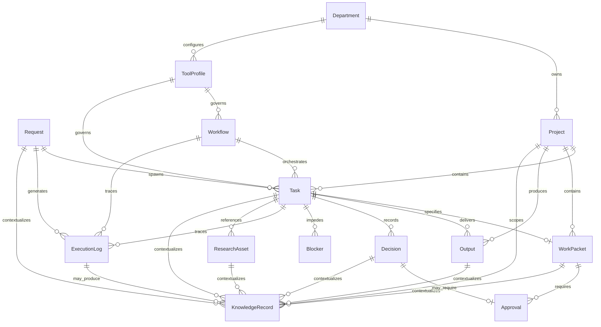

# System Entities

Canonical entity definitions for the **AI Command Center** core platform.

This document is **conceptual architecture only**. It defines shared vocabulary, required fields, relationships, and lifecycle states. It does not prescribe database schemas, tables, or storage technology.

Implementation domains (for example, GovCon) may extend these entities with domain-specific attributes without redefining the core model.

## Entity Catalog

Fourteen canonical entities define the AI Command Center core platform:

| # | Entity | Primary role |
|---|--------|--------------|
| 1 | Request | Inbound intent and work initiation |
| 2 | Project | Durable container for related work |
| 3 | Department | Routing, ownership, and accountability |
| 4 | Task | Atomic unit of executable work |
| 5 | Work Packet | Structured work specification |
| 6 | Decision | Recorded choice with rationale |
| 7 | Approval | Authorization gate |
| 8 | Research Asset | Raw knowledge inputs |
| 9 | Output | Deliverables |
| 10 | Workflow | Orchestrated step sequences |
| 11 | Tool Profile | Tool and integration boundaries |
| 12 | Execution Log | Append-only action audit |
| 13 | Blocker | Progress impediment |
| 14 | Knowledge Record | Curated reusable memory and context |

---

## Entity Relationship Overview

---

## 1. Request

### Purpose

Captures inbound intent—a question, command, or trigger that initiates or continues work in the Command Center. Requests are the primary entry point from humans, automations, or external systems.

### Required Fields

| Field | Description |
|-------|-------------|
| `id` | Unique identifier |
| `source` | Origin of the request (human, automation, webhook, scheduled job) |
| `intent` | Short statement of what is being asked |
| `submitted_at` | Timestamp of receipt |
| `status` | Current lifecycle state |

### Relationships

- **Spawns** zero or more **Tasks**
- **Generates** zero or more **Execution Log** entries
- May reference a **Project** when scoped to existing work
- May reference a **Department** for routing
- May be contextualized by zero or more **Knowledge Records**

### Lifecycle Status Values

| Status | Meaning |
|--------|---------|
| `received` | Logged but not yet triaged |
| `triaged` | Routed to a department, project, or task |
| `in_progress` | Active work has started |
| `completed` | Request fulfilled or closed |
| `rejected` | Request declined (out of scope, invalid, or duplicate) |
| `cancelled` | Request withdrawn before completion |

---

## 2. Project

### Purpose

A durable container for related work over time. Projects group tasks, work packets, research, and outputs under a shared goal without binding the platform to any single industry domain.

### Required Fields

| Field | Description |
|-------|-------------|
| `id` | Unique identifier |
| `name` | Human-readable project title |
| `objective` | What the project is meant to achieve |
| `owning_department_id` | Department accountable for the project |
| `created_at` | Timestamp of creation |
| `status` | Current lifecycle state |

### Relationships

- **Owned by** one **Department**
- **Contains** zero or more **Tasks**, **Work Packets**, **Outputs**, **Research Assets**, and **Knowledge Records**
- May accumulate **Blockers** at the project level
- May reference an optional **Workflow** template

### Lifecycle Status Values

| Status | Meaning |
|--------|---------|
| `draft` | Defined but not yet active |
| `active` | Work is underway |
| `on_hold` | Paused pending external input or approval |
| `completed` | Objective met; no further work expected |
| `archived` | Closed and retained for reference only |
| `cancelled` | Abandoned before completion |

---

## 3. Department

### Purpose

Represents an organizational unit responsible for a domain of work (for example, Research, Engineering, Operations). Departments route requests, own projects, and define default tool and approval boundaries.

### Required Fields

| Field | Description |
|-------|-------------|
| `id` | Unique identifier |
| `name` | Department name |
| `mission` | Scope of responsibility |
| `created_at` | Timestamp of creation |
| `status` | Current lifecycle state |

### Relationships

- **Owns** zero or more **Projects**
- **Configures** zero or more **Tool Profiles**
- **Receives** routed **Requests**
- May define default **Workflow** templates and **Approval** policies

### Lifecycle Status Values

| Status | Meaning |
|--------|---------|
| `active` | Operational and accepting work |
| `inactive` | Temporarily not routing new work |
| `archived` | Retired; historical reference only |

---

## 4. Task

### Purpose

The atomic unit of executable work. A task represents something the Command Center (human or agent) must do, track, and close.

### Required Fields

| Field | Description |
|-------|-------------|
| `id` | Unique identifier |
| `title` | Short description of the work |
| `project_id` | Parent project |
| `department_id` | Accountable department |
| `priority` | Relative urgency (for example, low, normal, high, critical) |
| `created_at` | Timestamp of creation |
| `status` | Current lifecycle state |

### Relationships

- **Belongs to** one **Project** and one **Department**
- **May specify** one **Work Packet**
- **May follow** one **Workflow** instance
- **Governed by** one **Tool Profile**
- **Produces** zero or more **Outputs**
- **Records** zero or more **Decisions**, **Execution Logs**, and **Blockers**
- **References** zero or more **Research Assets**
- **May require** zero or more **Approvals**
- **Spawned from** zero or one **Request**
- May be contextualized by zero or more **Knowledge Records**

### Lifecycle Status Values

| Status | Meaning |
|--------|---------|
| `backlog` | Defined but not started |
| `ready` | Scoped and unblocked; may start |
| `in_progress` | Actively being worked |
| `blocked` | Cannot proceed; see linked **Blocker** |
| `in_review` | Work complete; awaiting verification or approval |
| `done` | Accepted as complete |
| `cancelled` | Will not be completed |

---

## 5. Work Packet

### Purpose

A structured specification that defines what must be done, constraints, acceptance criteria, and context for a task or project slice. Work packets are the primary handoff artifact between requesters and executors (human or agent).

### Required Fields

| Field | Description |
|-------|-------------|
| `id` | Unique identifier |
| `title` | Packet name |
| `objective` | Intended outcome |
| `scope` | What is in and out of bounds |
| `acceptance_criteria` | Conditions for completion |
| `parent_type` | Whether attached to a `task` or `project` |
| `parent_id` | Identifier of the parent task or project |
| `created_at` | Timestamp of creation |
| `status` | Current lifecycle state |

### Relationships

- **Attached to** one **Task** or one **Project**
- **May require** zero or more **Approvals** before execution
- **References** zero or more **Research Assets**
- **May spawn** one or more **Tasks** when decomposed
- **May be blocked by** zero or more **Blockers**
- May be contextualized by zero or more **Knowledge Records**

### Lifecycle Status Values

| Status | Meaning |
|--------|---------|
| `draft` | Being authored; not ready for execution |
| `ready` | Complete enough to start work |
| `in_execution` | Active work against this packet |
| `pending_approval` | Awaiting required approvals |
| `accepted` | Work verified against acceptance criteria |
| `superseded` | Replaced by a newer packet |
| `cancelled` | No longer valid |

---

## 6. Decision

### Purpose

Records a choice made during execution—what was decided, why, and by whom (human or agent). Decisions create an auditable reasoning trail and may trigger approval requirements.

### Required Fields

| Field | Description |
|-------|-------------|
| `id` | Unique identifier |
| `summary` | What was decided |
| `rationale` | Why this option was chosen |
| `decided_by` | Actor (human, agent, or system) |
| `decided_at` | Timestamp of the decision |
| `task_id` | Task context for the decision |
| `status` | Current lifecycle state |

### Relationships

- **Belongs to** one **Task**
- **May require** zero or one **Approval**
- **Referenced by** zero or more **Execution Log** entries
- **May affect** one **Work Packet**, **Workflow**, or **Output**
- May be contextualized by zero or more **Knowledge Records**

### Lifecycle Status Values

| Status | Meaning |
|--------|---------|
| `proposed` | Decision recorded but not yet validated |
| `confirmed` | Decision accepted as final |
| `pending_approval` | Awaiting approval before taking effect |
| `approved` | Approved and in effect |
| `rejected` | Decision overturned or denied |
| `superseded` | Replaced by a later decision |

---

## 7. Approval

### Purpose

Represents an authorization gate for actions that exceed autonomous execution boundaries—high-risk changes, external communications, spend, or policy-sensitive outputs.

### Required Fields

| Field | Description |
|-------|-------------|
| `id` | Unique identifier |
| `subject_type` | What is being approved (`decision`, `task`, `work_packet`, `output`) |
| `subject_id` | Identifier of the subject entity |
| `requested_by` | Actor who requested approval |
| `requested_at` | Timestamp of the request |
| `approver` | Human or role authorized to approve |
| `status` | Current lifecycle state |

### Relationships

- **Targets** one **Decision**, **Task**, **Work Packet**, or **Output**
- **Requested by** an actor linked to a **Task** or **Execution Log**
- **May block** progression of the subject entity until resolved
- **Governed by** **Department** approval policies

### Lifecycle Status Values

| Status | Meaning |
|--------|---------|
| `pending` | Awaiting reviewer action |
| `approved` | Authorization granted |
| `rejected` | Authorization denied |
| `expired` | Not acted on within the allowed window |
| `withdrawn` | Request cancelled by the requester |

---

## 8. Research Asset

### Purpose

Captures knowledge inputs used to inform work—documents, URLs, notes, transcripts, datasets, or retrieved context. Research assets are reusable across tasks and projects.

### Required Fields

| Field | Description |
|-------|-------------|
| `id` | Unique identifier |
| `title` | Asset label |
| `asset_type` | Category (document, url, note, dataset, transcript, other) |
| `source` | Where the asset came from |
| `captured_at` | Timestamp of capture or ingestion |
| `status` | Current lifecycle state |

### Relationships

- **Referenced by** zero or more **Tasks**, **Work Packets**, and **Projects**
- **May inform** zero or more **Decisions** and **Outputs**
- **May be cited in** **Execution Log** entries
- May be contextualized by zero or more **Knowledge Records**

### Lifecycle Status Values

| Status | Meaning |
|--------|---------|
| `draft` | Partial or unverified capture |
| `active` | Trusted and available for use |
| `stale` | May be outdated; refresh recommended |
| `archived` | Retained but not used for new work |
| `rejected` | Deemed unreliable or out of scope |

---

## 9. Output

### Purpose

A deliverable produced by completed or in-progress work—a report, artifact, message draft, code change summary, or other tangible result handed back to the requester or downstream system.

### Required Fields

| Field | Description |
|-------|-------------|
| `id` | Unique identifier |
| `title` | Output name |
| `output_type` | Category (report, artifact, message, data, other) |
| `task_id` | Task that produced the output |
| `project_id` | Parent project |
| `produced_at` | Timestamp of production |
| `status` | Current lifecycle state |

### Relationships

- **Produced by** one **Task**
- **Belongs to** one **Project**
- **May require** zero or more **Approvals** before release
- **May reference** zero or more **Research Assets**
- **May fulfill** one **Work Packet** acceptance criterion set
- May be contextualized by zero or more **Knowledge Records**

### Lifecycle Status Values

| Status | Meaning |
|--------|---------|
| `draft` | In progress; not ready for review |
| `in_review` | Awaiting quality or approval check |
| `approved` | Cleared for delivery |
| `delivered` | Released to the requester or target system |
| `superseded` | Replaced by a newer output |
| `rejected` | Not accepted; requires rework |

---

## 10. Workflow

### Purpose

Defines or tracks an orchestrated sequence of steps—either as a reusable template or as a running instance that coordinates multiple tasks toward an outcome.

### Required Fields

| Field | Description |
|-------|-------------|
| `id` | Unique identifier |
| `name` | Workflow name |
| `kind` | `template` or `instance` |
| `definition` | Ordered steps, triggers, and handoff rules (conceptual) |
| `created_at` | Timestamp of creation |
| `status` | Current lifecycle state |

### Relationships

- **Orchestrates** zero or more **Tasks** (when `kind` is `instance`)
- **May belong to** one **Project** or **Department**
- **Governed by** one **Tool Profile**
- **Generates** zero or more **Execution Log** entries
- **May be referenced by** **Work Packets** as the execution plan

### Lifecycle Status Values

| Status | Meaning |
|--------|---------|
| `draft` | Template or instance being defined |
| `active` | Instance running or template published for use |
| `paused` | Instance suspended |
| `completed` | Instance finished successfully |
| `failed` | Instance terminated due to error or blocker |
| `archived` | Template retired or instance closed |

---

## 11. Tool Profile

### Purpose

Defines which tools, integrations, and execution boundaries apply to a department, workflow, or task. Tool profiles enforce least-privilege access for agents and automations.

### Required Fields

| Field | Description |
|-------|-------------|
| `id` | Unique identifier |
| `name` | Profile name |
| `allowed_tools` | Set of permitted tool identifiers |
| `constraints` | Limits (rate, scope, environment, approval triggers) |
| `owner_department_id` | Department that maintains the profile |
| `status` | Current lifecycle state |

### Relationships

- **Owned by** one **Department**
- **Governs** zero or more **Workflows** and **Tasks**
- **May trigger** **Approval** requirements when constrained actions are attempted
- **Referenced in** **Execution Log** entries when tools are invoked

### Lifecycle Status Values

| Status | Meaning |
|--------|---------|
| `draft` | Being configured; not assigned |
| `active` | In use by workflows or tasks |
| `deprecated` | Scheduled for replacement |
| `archived` | No longer assignable |

---

## 12. Execution Log

### Purpose

An append-only audit trail of actions taken during Command Center operation—tool calls, state transitions, errors, and human interventions. Execution logs support debugging, compliance, and post-hoc review.

### Required Fields

| Field | Description |
|-------|-------------|
| `id` | Unique identifier |
| `event_type` | Category (tool_call, state_change, error, note, approval_action) |
| `actor` | Human, agent, or system that performed the action |
| `occurred_at` | Timestamp of the event |
| `summary` | Human-readable description |
| `context_type` | Parent entity type (`request`, `task`, `workflow`) |
| `context_id` | Identifier of the parent entity |

### Relationships

- **Belongs to** one contextual entity (**Request**, **Task**, or **Workflow**)
- **May reference** a **Decision**, **Approval**, **Tool Profile**, or **Blocker**
- **May produce** zero or more **Knowledge Records** when curated context is extracted from execution
- **Does not mutate** other entities; it records what happened

### Lifecycle Status Values

| Status | Meaning |
|--------|---------|
| `recorded` | Event persisted successfully |
| `flagged` | Marked for review (anomaly, error, or policy concern) |
| `reviewed` | Review complete; no further action required |
| `corrected` | Supplemental log entry added to clarify or amend context |

> **Note:** Execution logs are append-only. Status changes reflect review metadata, not deletion or rewriting of historical events.

---

## 13. Blocker

### Purpose

Represents an impediment that prevents a task, work packet, or project from progressing until resolved. Blockers make stalled work visible and assignable.

### Required Fields

| Field | Description |
|-------|-------------|
| `id` | Unique identifier |
| `description` | What is blocking progress |
| `blocked_entity_type` | `task` or `work_packet` (see note below) |
| `blocked_entity_id` | Identifier of the blocked entity |
| `severity` | Impact level (low, medium, high, critical) |
| `reported_by` | Actor who raised the blocker |
| `reported_at` | Timestamp reported |
| `status` | Current lifecycle state |

> **Deployed schema note:** The `blocked_entity_type` column is constrained by a database `CHECK` to `('task', 'work_packet')` only (migration `011_governance_layer.sql`). Blocking a `project` entity is intentionally deferred and is not valid in the current deployed schema. This conceptual model will be updated when project-level blockers are implemented.

### Relationships

- **Blocks** one **Task** or **Work Packet** (project-level blocking is deferred; see note above)
- **May require** one **Approval** or **Decision** to resolve
- **May reference** zero or more **Research Assets** as supporting context
- **Generates** **Execution Log** entries on creation and resolution

### Lifecycle Status Values

| Status | Meaning |
|--------|---------|
| `open` | Active impediment |
| `investigating` | Owner assigned; root cause being determined |
| `pending_external` | Waiting on outside party |
| `resolved` | Blocker cleared; work may resume |
| `won_t_fix` | Accepted as permanent constraint; work rerouted or cancelled |

---

## 14. Knowledge Record

### Purpose

A curated memory object used by the AI Command Center to preserve reusable context, summaries, operating knowledge, and lessons learned across projects, requests, tasks, work packets, decisions, research assets, and outputs.

Knowledge records are synthesized and retrievable — distinct from raw **Research Assets**, formal **Decisions**, and append-only **Execution Logs**. They support agent continuity and organizational memory without duplicating audit or deliverable entities.

### Required Fields

| Field | Description |
|-------|-------------|
| `id` | Unique identifier |
| `organization_id` | Tenant scope for the record |
| `project_id` | Optional project anchor for query scoping when the subject is nested or cross-cutting |
| `subject_type` | Entity the record is attached to (`project`, `request`, `task`, `work_packet`, `decision`, `research_asset`, `output`) |
| `subject_id` | Identifier of the subject entity |
| `record_type` | Category of knowledge (for example, summary, context, constraint, lesson, index, synthesis) |
| `title` | Short label for the record |
| `summary` | Brief abstract of the knowledge captured |
| `content` | Full curated content body |
| `source` | Origin of the knowledge (human, agent, execution log, research asset, or other) |
| `confidence` | Reliability indicator (for example, low, medium, high, verified) |
| `created_by` | Actor (human, agent, or system) that authored the record |
| `created_at` | Timestamp of creation |
| `updated_at` | Timestamp of last update |
| `status` | Current lifecycle state |

### Relationships

- **Belongs to** one **Organization** (via `organization_id`)
- **May belong to** one **Project** (via optional `project_id`)
- **May reference** one **Request**, **Task**, **Work Packet**, **Decision**, **Research Asset**, or **Output** via `subject_type` + `subject_id`
- **May be produced from** one or more **Execution Logs** when context is extracted from operational history
- **Does not replace** **Research Assets** (raw inputs), **Decisions** (point-in-time choices), or **Outputs** (deliverables)

### Lifecycle Status Values

| Status | Meaning |
|--------|---------|
| `draft` | Being authored; not yet trusted for agent retrieval |
| `active` | Trusted and available for use |
| `superseded` | Replaced by a newer knowledge record |
| `archived` | Retained but not used for new work |

---

## Cross-Entity Conventions

### Identifiers

All entities use opaque, globally unique `id` values. Format is an implementation concern; conceptual model treats `id` as immutable.

### Timestamps

Entities that track time use ISO 8601 timestamps in UTC at the conceptual level. Storage and display localization are implementation concerns.

### Status Transitions

- Status values listed above are the **canonical set** for each entity.
- Not every transition is valid between all states; workflow-specific rules may restrict paths.
- Transitions that release outputs, invoke external tools, or commit irreversible actions should produce **Execution Log** entries and may require **Approval**.

### Polymorphic Subject References

**Knowledge Records**, **Approvals**, **Blockers**, and **Work Packets** (parent attachment) use a `*_type` + `*_id` pair to reference subject entities. Valid `subject_type` values for **Knowledge Records** are: `project`, `request`, `task`, `work_packet`, `decision`, `research_asset`, `output`. Referenced rows must belong to the same organization.

### Knowledge Layer Distinction

| Entity | Role |
|--------|------|
| **Research Asset** | Raw, reusable input — documents, URLs, datasets |
| **Decision** | Point-in-time choice with rationale tied to a task |
| **Execution Log** | Append-only audit of actions taken |
| **Output** | Deliverable produced for requester or downstream system |
| **Knowledge Record** | Curated, retrievable synthesis spanning any core entity |

Agents retrieve **Knowledge Records** for context; they cite **Execution Logs** for audit; they consume **Research Assets** as sources.

### Domain Extensions

Implementation domains (for example, GovCon) may add optional attributes and domain-specific status sub-states. Domain extensions must not replace or rename core entities defined in this document.
