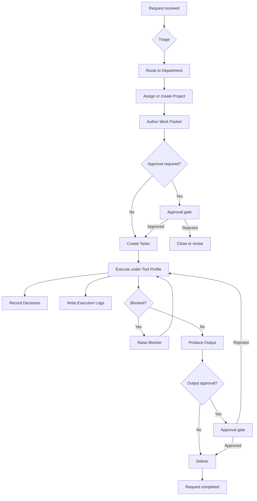

# System Overview

High-level description of the **AI Command Center** core platform — purpose, operating model, and document relationships.

> **Entity source of truth:** [system-entities.md](system-entities.md) defines all canonical entities, fields, relationships, and lifecycle states. This document describes how they work together; it does not redefine them.

---

## Purpose

The AI Command Center coordinates work from initial **Request** through scoped execution to delivered **Output**. It provides:

- **Routing** — Requests triaged to the correct **Department** and **Project**
- **Specification** — Work defined in structured **Work Packets** with acceptance criteria
- **Execution** — **Tasks** run by humans or agents under **Tool Profiles** and **Workflows**
- **Governance** — **Approvals** and **Decisions** gate high-risk actions
- **Auditability** — **Execution Logs** record what happened and why
- **Visibility** — **Blockers** surface stalled work

The platform is domain-agnostic. Implementation domains (for example, GovCon) add context and attributes without changing the core entity model.

---

## Platform vs. Implementation Domains

| Layer | Role | Example |
|-------|------|---------|
| **Core platform** | Shared entities, departments, approvals, work packets | AI Command Center (this repo) |
| **Implementation domain** | Vertical-specific extensions and workflows | GovCon capture pipeline, compliance checks |

Domain extensions must attach to core entities defined in [system-entities.md](system-entities.md). They must not introduce parallel entity types that duplicate Request, Task, Work Packet, or Output.

---

## Operating Flow



### Flow Stages

1. **Intake** — A **Request** arrives (human, automation, webhook, or scheduled job). Status: `received`.
2. **Triage** — Request routed to a **Department** using [department-map.md](department-map.md). Status: `triaged`.
3. **Scoping** — Work assigned to a **Project** (new or existing). A **Work Packet** defines objective, scope, and acceptance criteria. See [work-packet-template.md](work-packet-template.md).
4. **Authorization** — If [approval-rules.md](approval-rules.md) require it, the Work Packet or Task waits at an **Approval** gate before execution.
5. **Execution** — **Tasks** run under a **Tool Profile** ([tool-stack.md](tool-stack.md)). **Workflows** may orchestrate multi-step sequences.
6. **Recording** — **Decisions**, **Research Assets**, and **Execution Logs** accumulate during execution.
7. **Delivery** — **Outputs** produced by Tasks are reviewed and, where required, approved before release.
8. **Completion** — Request status moves to `completed`. Project and Task statuses updated accordingly.

---

## Entity Layers

```text
Intake Layer       Request
Organizational     Department, Project
Specification      Work Packet, Research Asset
Execution          Task, Workflow, Tool Profile
Governance         Decision, Approval, Blocker
Audit & Delivery   Execution Log, Output
```

Full definitions: [system-entities.md](system-entities.md).

---

## Key Relationships

| From | To | Relationship |
|------|----|--------------|
| Request | Task | Spawns executable work |
| Department | Project | Owns and routes |
| Project | Task, Work Packet, Output | Contains |
| Task | Work Packet | Specifies what to do |
| Task | Tool Profile | Governs permitted tools |
| Work Packet | Approval | May require before execution |
| Task | Decision, Blocker, Execution Log | Records during execution |
| Task | Output | Produces deliverables |

---

## Document Map

| Document | Answers |
|----------|---------|
| [system-entities.md](system-entities.md) | What are the entities and their lifecycle states? |
| [work-packet-template.md](work-packet-template.md) | How do I author a Work Packet? |
| [department-map.md](department-map.md) | Which Department owns this work? |
| [approval-rules.md](approval-rules.md) | When is Approval required? |
| [tool-stack.md](tool-stack.md) | What tools and integrations are available? |

---

## Phase 0 Scope

This repository currently contains **documentation and operating structure only**:

- No application code or frameworks
- No Supabase schema or database tables
- No domain-specific product modules

Phase 0 completes when all docs in the [README](../README.md) index exist and are reviewed. The next phase (**APP 5 — Supabase Setup Validation**) designs the runtime data model mapped from [system-entities.md](system-entities.md).

---

## Design Principles

1. **Entities before storage** — Conceptual model is stable; persistence is an implementation choice.
2. **Work Packets before workflows** — Clear specification reduces rework during orchestration.
3. **Approvals before autonomy** — High-risk actions require human authorization by default.
4. **Audit by default** — Material actions produce Execution Log entries.
5. **Domains extend, never replace** — GovCon and other verticals plug into core entities.
